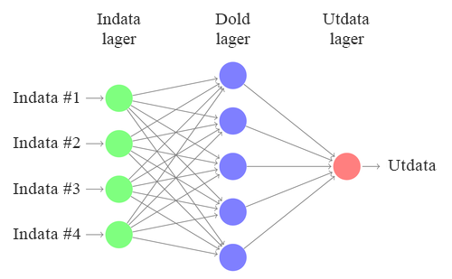
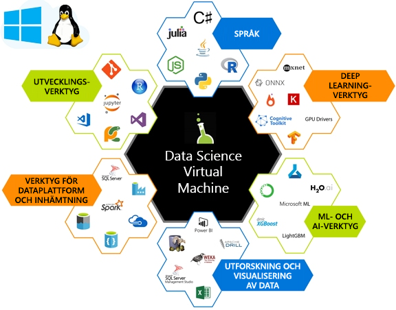

Målet med maskininlärning är att hitta funktioner för att ta fram en modell som omvandlar indata (t.ex. bilder, tidsserier eller ljud) till vissa utdata (t.ex. bildtexter, prisvärden, transkriptioner).The goal of Machine Learning (ML) is to find features to train a model that transforms input data (such as pictures, time series, or audio) to a given output (for example captions, price values, transcriptions). I traditionella datavetenskap förs funktionerna ofta för hand.In traditional data science, features are often handcrafted. Dessa handgjorda funktioner matas in i en grund inlärningsalgoritm, till exempel nätverket som visas i följande diagram.These handcrafted features are fed into a shallow learning algorithm, such as the network shown in the following diagram. 

Inom djupinlärning är funktionsextraheringen en process som lärs in genom att indata representeras som vektorer och transformeras med ett antal smarta linjära algebraåtgärder till givna utdata.In Deep Learning (DL), the process of feature extraction is learned through representing inputs as vectors and transforming them, with a series of clever linear algebra operations, into a given output.  Modellutdata jämförs med förväntade utdata med hjälp av en förlustfunktionsekvation.The model output is compared against the expected output using an equation called a loss function. Värdet som returneras av förlustfunktionen för respektive utbildnings indata används för att hjälpa modellen att extrahera funktioner som resulterar i ett lägre förlustvärde nästa pass.The value returned by the loss function of each training input is used to guide the model to extract features that will result in a lower loss value on the next pass. Processen kallas för *träning*.This process is called *training*. 

Genom träning kan dess algoritmer lära sig vilka funktioner som presterar bäst och är mest lämpliga för den givna datamängden.Through training, these algorithms learn the best performing and most appropriate features for the given dataset. De kallas för djupa på grund av antalet lager i nätverket.They are called deep because of the number of layers in the network.  

De matrisåtgärder som vi beräknar som en dela av den linjära algebrakomponenten är beräkningsmässigt dyra.The series of matrix operations that we compute as part of the linear algebra component are computationally expensive. Dessa åtgärder kan ofta bearbetas parallellt, vilket göra dem till bra kandidater för specialiserade beräkningar, till exempel grafiska processorer (GPU) för att beräkna effektivt.These operations can often be processed in parallel, making them great candidates for specialized compute such as Graphics Processing Units (GPUs) to compute efficiently.

Det är inte helt enkelt att konfigurera en miljö för djupinlärning.Setting up an environment to do deep learning is non-trivial. Hur ska maskinvaran konfigureras, måste du träna modellen med processorer eller grafikprocessorer och hur mycket minne ska datorerna ha?What's the hardware setup, do you train your model with CPUs or GPUs, and how much memory should these machines have? Om du vill skapa och träna ett djupinlärningsnätverk måste du installera rätt programvara.Creating and training a deep learning network needs the right software to be installed. Du har många djupinlärningsramverk att välja mellan men du måste vara uppmärksam på beroenden mellan varje komponent.You've lots of  deep learning frameworks to choose from, but need to be mindful of dependencies between each component. När allt detta är konfigurerat kanske du hittar en bra modell som skapats på ett annat ramverk och vill prova det. Du vill slippa omkostnaden för att skaffa ett nytt djupinlärningsramverk med alla dess beroenden konfigurerade på din dator.After all of this setup, you might find a great model created on another framework and would like to try it out. You don’t want the overhead of getting a new deep learning framework with all of its dependencies set up on your machine. Med Data Science Virtual Machine kan du lösa dess problem.The Data Science Virtual Machine can help solve these problems. 

## Vad är Data Science Virtual Machine (DSVM)?What is a Data Science Virtual Machine (DSVM)?

Data Science Virtual Machine är en virtuell dator-avbildning på Azure.The Data Science Virtual Machine is a virtual machine (VM) image on Azure. Den har många populära datavetenskaps- och djupinlärningsverktyg installerade och konfigurerade.It has many popular data science and deep learning tools already installed and configured. Dessa avbildningar levereras med populära datavetenskaps- och maskininlärningsverktyg, som Microsoft R Server Developer Edition, Microsoft R Open, Anaconda Python, Julia, Jupyter-anteckningsböcker, Visual Studio Code, RStudio, xgboost och många fler.These images come with popular data science and machine learning tools, including Microsoft R Server Developer Edition, Microsoft R Open, Anaconda Python, Julia, Jupyter notebooks, Visual Studio Code, RStudio, xgboost, and many more.  I stället för att distribuera en jämförbar arbetsyta på egen hand kan du etablera en DSVM – och på så sätt spara mycket tid på installation, konfiguration och pakethanteringsprocesser.Instead of rolling out a comparable workspace on your own, you can provision a DSVM - saving you lots of time on the installation, configuration, and package management processes. När din DSVM har distribuerats kan du omedelbart börja arbeta med ditt datavetenskapsprojekt.Once your DSVM has been deployed, you can immediately begin working on your data science project.

DSVM kan användas till att träna modeller med hjälp av djupinlärningsalgoritmer på maskinvara för grafikprocessorer (GPU).The DSVM can be used for training models using deep learning algorithms on Graphics processing units (GPUs) hardware. Genom att utnyttja Azure-molnets VM-skalningsfunktioner hjälper DSVM dig att använda GPU-baserad maskinvara i molnet enligt behov.Utilizing VM scaling capabilities of Azure cloud, DSVM helps you use GPU-based hardware on the cloud as per need. Du kan växla till en GPU-baserad virtuell dator vid utbildning av stora modeller eller behov av snabba beräkningar samtidigt som samma OS-disk behålls.You can switch to a GPU-based VM when training large models or need high-speed computations while keeping the same OS disk. Windows Server 2016-versionen av DSVM levereras förinstallerad med GPU-drivrutiner, -ramverk och GPU-versioner av djupinlärningsramverk.The Windows Server 2016 edition of DSVM comes pre-installed with GPU drivers, frameworks, and GPU versions of deep learning frameworks. I Linux är djupinlärning på GPU aktiverat på DSVM för både CentOS och Ubuntu.On the Linux, deep learning on GPU is enabled on both the CentOS and Ubuntu DSVMs. Du kan även distribuera Ubuntu-, CentOS- eller Windows 2016-versionen av den virtuella datorn för datavetenskap till icke CPU-baserade virtuella Azure-datorer. Då återställs alla djupinlärningsramverk till CPU-läget.You can also deploy the Ubuntu, CentOS, or Windows 2016 edition of the Data Science VM to CPU-based Azure virtual machines, in which case all the deep learning frameworks will fallback to CPU mode. 

Mer information om vad du kan göra med en DSVM finns i [Data science with a Linux Data Science Virtual Machine on Azure](https://docs.microsoft.com/azure/machine-learning/data-science-virtual-machine/linux-dsvm-walkthrough) (Datavetenskap med en Linux Data Science Virtual Machine på Azure)For more information on what you can do with a DSVM, see [Data science with a Linux Data Science Virtual Machine on Azure](https://docs.microsoft.com/azure/machine-learning/data-science-virtual-machine/linux-dsvm-walkthrough)

