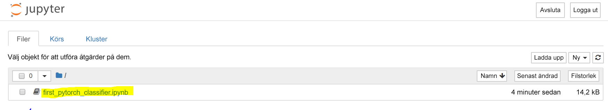
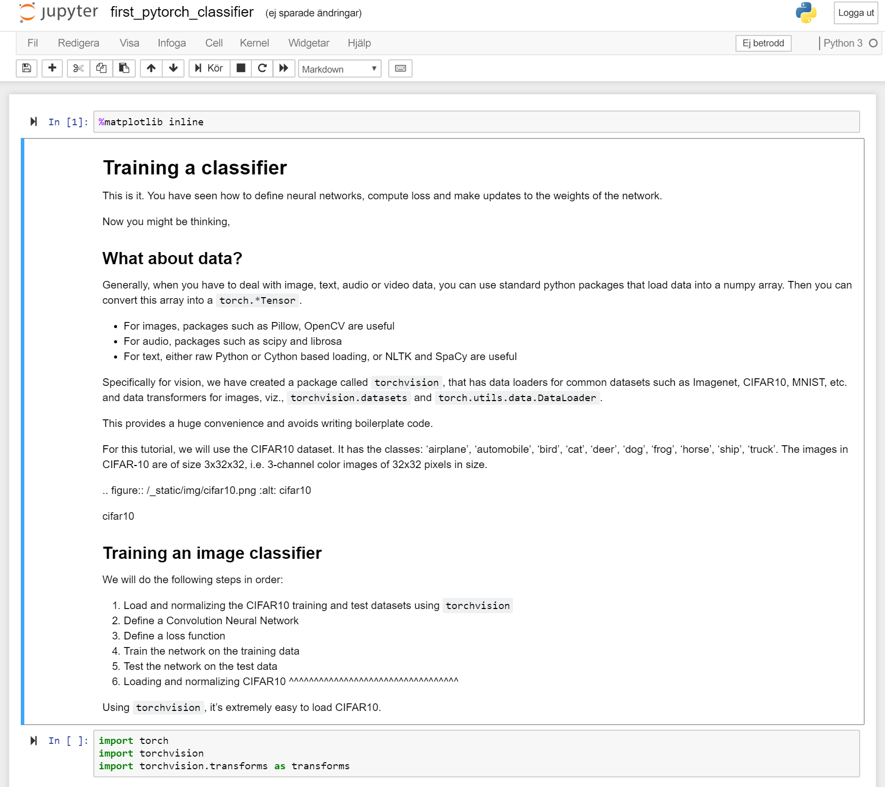

## Träna din första modell för djupinlärning med hjälp av PyTorch och Jupyter

 

Vanligtvis brukar inte djupinlärningsteknikerna hårdkoda matrisalgebraoperationer helt och hållet för hand. I stället använder de ramverk som PyTorch eller TensorFlow.  

PyTorch är ett Python-baserat ramverk som ger flexibilitet som utvecklingsplattform för djupinlärning. PyTorchs arbetsflöde bygger på Pythons NumPy-bibliotek för vetenskaplig databehandling. 

Nu kanske du undrar varför vi ska använda PyTorch för att skapa modeller för djupinlärning?  

- Lättanvänd API – det är så enkelt Python kan vara.
- Stöd för Python – PyTorch integreras smidigt med stacken för vetenskaplig databehandling.
- Dynamiska beräkningsdiagram – i stället för fördefinierade diagram med specifika funktioner bygger PyTorch databaserade diagram dynamiskt, vilka kan ändras under körning. Dynamiska beräkningsdiagram är värdefulla för kapslad batchbearbetning och när vi inte vet hur mycket minne som krävs för att skapa ett visst nätverk.

## Köra din första PyTorch-modell

Gå till den Jupyter Notebook som du konfigurerade i det senaste kapitlet.

- [[VÄRDNAMN FÖR DSVM]].westus2.cloudapp.azure.com:8888/?token={sometoken}

Välja anteckningsboken first_pytorch_classifier.ipynb

Följ anvisningarna i anteckningsboken för att träna din första PyTorch-klassificerare.

