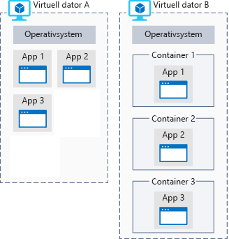

Ditt forskningsteam har samlat in enorma mängder bilddata som kanske kan leda till en upptäckt på Mars.Your research team has collected massive amounts of image data that might lead to a discovery on Mars. De behöver utföra beräkningsintensiv databehandling men har inte den utrustning som krävs för arbetet.They need to perform computationally intense data processing but don't have the equipment to do the work. Vi tittar på varför Azure är ett bra alternativ för den här dataanalysen.Let's see why Azure is a good choice to do the data analysis.

## Vad är Azure Compute?What is Azure compute?
Azure Compute är en databehandlingstjänst på begäran för körning av molnbaserade program.Azure compute is an on-demand computing service for running cloud-based applications. Den innehåller resurser som processorer med flera kärnor och superdatorer som du får tillgång till via virtuella datorer och containrar.It provides computing resources like multi-core processors and supercomputers via virtual machines and containers. Dessutom finns serverfri databehandling så att du kan köra appar utan att behöva installera eller konfigurera någon infrastruktur.It also provides serverless computing to run apps without requiring infrastructure setup or configuration. Resurserna är tillgängliga på begäran och kan vanligtvis skapas på bara några minuter eller till och med sekunder.The resources are available on-demand and can typically be created in minutes or even seconds. Du betalar bara för de resurser du använder och endast så länge du använder dem.You pay only for the resources you use and only for as long as you're using them.

Det finns tre vanliga tekniker för databehandling i Azure:There are three common techniques for performing compute in Azure:

- Virtuella datorerVirtual machines
- ContainrarContainers
- Serverfri databehandlingServerless computing

## Vad är virtuella datorer?What are virtual machines?

**Virtuella datorer**, eller VM, är programvaruemuleringar av fysiska datorer.**Virtual machines**, or VMs, are software emulations of physical computers. De innehåller en virtuell processor, minne, lagring och nätverksresurser.They include a virtual processor, memory, storage, and networking resources. De är värd för ett operativsystem, och du kan installera och köra programvara precis som på en fysisk dator.They host an operating system, and you're able to install and run software just like a physical computer. Via en fjärrskrivbordsklient kan du använda och styra den virtuella datorn precis som om du satt framför den.And by using a remote desktop client, you can use and control the virtual machine as if you were sitting in front it.

:::row:::
  :::column:::
    
  :::column-end:::
    ::: kolumnomfång = ”3”::: **Virtuella datorer i Azure**:::column span="3"::: **Virtual machines in Azure**

Virtuella datorer kan skapas och hanteras i Azure.Virtual machines can be created and hosted in Azure. I vanliga fall kan du skapa och etablera nya virtuella datorer på bara några minuter genom att välja en förkonfigurerad avbildning.Typically, new virtual machines can be created and provisioned in minutes by selecting a pre-configured virtual machine image.

Att välja avbildning är ett av de viktigaste besluten när du skapar en virtuell dator.Selecting an image is one of the most important decisions you'll make when creating a VM. Avbildningar är mallar som används till att skapa virtuella datorer.An image is a template used to create a virtual machine. Dessa mallar har redan ett operativsystem (OS) och ofta annan programvara, till exempel utvecklingsverktyg eller värdmiljöer för webben.These templates already include an operating system (OS) and often other software, such as development tools or web hosting environments.

  :::column-end:::
:::row-end:::

## Vad är containrar?What are containers?

> [!VIDEO https://www.microsoft.com/videoplayer/embed/RE2yMhY]

Containrar är en virtualiseringsmiljö, men till skillnad från virtuella datorer har de inget operativsystem.Containers are a virtualization environment but, unlike a virtual machine, they do not include an operating system. I stället refererar de till operativsystemet i den värdmiljö som kör containern.Instead, they reference the operating system of the host environment that runs the container. Om fem containrar till exempel körs på en server med en specifik Linux-kernel så körs alla fem containrar på samma kernel.For example, if five containers are running on a server with a specific Linux kernel, all five containers are running on that same kernel.

I följande illustration visas en jämförelse mellan program som körs direkt på en virtuell dator och program som körs i containrar på en virtuell dator.The following illustration shows a comparison between applications running directly on a VM and applications running inside containers on a VM.

Containrar innehåller normalt ett program som du skriver samt de bibliotek som krävs för att programmet ska kunna köras på värdmiljöns kernel.Containers typically contain an application that you write &mdash; along with any libraries required for your application to run on the host environment's kernel.

Containrar är tänkta att vara enkla och är utformade för att kunna skapas, skalas ut och stoppas dynamiskt.Containers are meant to be lightweight and are designed to be created, scaled out, and stopped dynamically. På så sätt kan du svara på ändringar i efterfrågan och snabbt starta om vid krasch eller avbrott i maskinvaran.This allows you to respond to changes on demand and quickly restart in case of a crash or hardware interruption.

Ytterligare en fördel med att använda containrar är att du kan köra flera isolerade program på en virtuell dator.An additional benefit of using containers is the ability to run multiple isolated applications on a virtual machine. Eftersom själva containrarna är skyddade och isolerade behöver du inte nödvändigtvis separata virtuella datorer för olika arbetsbelastningar.Since containers themselves are secured and isolated, you don't necessarily need separate VMs for separate workloads.

Azure har stöd för Docker-containrar och flera olika sätt att hantera dessa containrar.Azure supports Docker containers and several ways to manage those containers. Du kan hantera containrar manuellt eller med Azure-tjänster, till exempel Azure Kubernetes Service.Containers can be managed manually or with Azure services such as Azure Kubernetes Service.

### Vad är serverfri databehandling?What is serverless computing?

Serverfri databehandling är en molnbaserad körningsmiljö som kör din kod men där den underliggande värdmiljön är helt abstrakt.Serverless computing is a cloud-hosted execution environment that runs your code but completely abstracts the underlying hosting environment. Du skapar en instans av tjänsten och lägger till din kod, men du behöver inte, och kan inte, konfigurera eller underhålla någon infrastruktur.You create an instance of the service, and you add your code; no infrastructure configuration or maintenance is required, or even allowed.

#### Vad är serverfri databehandling?What is Serverless Computing?

> [!VIDEO https://www.microsoft.com/videoplayer/embed/RE2yzjL]

Du konfigurerar dina serverfria appar för att svara på _händelser_.You configure your serverless apps to respond to _events_. Det kan gälla en REST-slutpunkt, en periodisk timer eller till och med ett meddelande som tas emot från en annan Azure-tjänst.This could be a REST endpoint, a periodic timer, or even a message received from another Azure service. Den serverfria appen körs bara när den utlöses av en händelse.The serverless app runs only when it's triggered by an event.

Du ansvarar i princip inte för infrastrukturen.Essentially, infrastructure isn't your responsibility. Skalning och prestanda hanteras automatiskt, och du debiteras endast för de resurser du använder.Scaling and performance are handled automatically, and you are billed only for the exact resources you use. Du behöver inte ens reservera kapacitet.There's no need to even reserve capacity.

:::row:::
  :::column:::
    
  :::column-end:::
    ::: kolumnomfång = ”3”::: **Serverlös databehandling i Azure**:::column span="3"::: **Serverless computing in Azure**

Azure har två implementeringar av serverlös beräkning:Azure has two implementations of serverless compute:

- **Azure Functions**, som kan köra kod på nästan alla moderna språk.**Azure Functions** which can execute code in almost any modern language.
- **Azure Logic Apps**, som är utformade i en webbaserad designer och kan köra logik som utlöses av Azure-tjänster utan att du behöver skriva någon kod.**Azure Logic Apps** which are designed in a web-based designer and can execute logic triggered by Azure services without writing any code.

  :::column-end:::
:::row-end:::