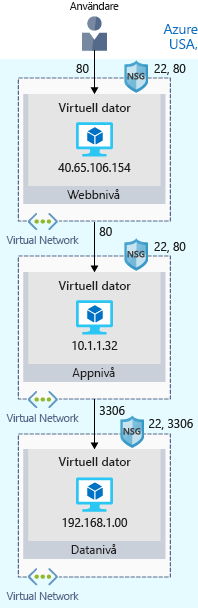

Första steget är sannolikt att återskapa din lokala konfiguration i molnet.Your first step will likely be to re-create your on-premises configuration in the cloud.

Den här grundläggande konfigurationen ger dig en uppfattning om hur nätverk konfigureras och hur nätverkstrafik färdas in i och ut från Azure.This basic configuration will give you a sense of how networks are configured, and how network traffic moves in and out of Azure.

## Kort om din e-handelswebbplatsYour e-commerce site at a glance

Större företagssystem består ofta av flera sammankopplade program och tjänster som fungerar tillsammans.Larger enterprise systems are often composed of multiple inter-connected applications and services that work together. Du kan ha ett klientdelswebbsystem som visar lager och låter kunder skapa en beställning.You might have a front-end web system that displays inventory and allows customers to create an order. Den kanske pratar med olika webbtjänster för att tillhandahålla lagerdata, hantera användarprofiler, bearbeta kreditkort och fullfölja begäranden av bearbetade beställningar.That might talk to a variety of web services to provide the inventory data, manage user profiles, process credit cards, and request fulfillment of processed orders.

Det finns flera strategier och mönster som används av programvaruarkitekter och utvecklare för att göra dessa komplexa system enklare att utforma, skapa, hantera och underhålla.There are several strategies and patterns employed by software architects and designers to make these complex systems easier to design, build, manage, and maintain. Låt oss titta på några av dem och starta med _löst sammansatta arkitekturer_.Let's look at a few of them, starting with _loosely coupled architectures_.

#### Fördelar med löst kopplade arkitekturerBenefits of Loosely Coupled Architectures

> [!VIDEO https://www.microsoft.com/videoplayer/embed/RE2yHrc]

### Använd en arkitektur på N-nivåUsing an N-tier architecture

Ett arkitekturmönster som kan användas för att skapa löst kopplade system är _N-nivå_.An architectural pattern that can be used to build loosely coupled systems is _N-tier_.

En [N-nivåarkitektur](https://docs.microsoft.com/azure/architecture/guide/architecture-styles/n-tier) delar in ett program i två eller fler logiska nivåer.An [N-tier architecture](https://docs.microsoft.com/azure/architecture/guide/architecture-styles/n-tier) divides an application into two or more logical tiers. Arkitektoniskt sett kan en högre nivå komma åt tjänster från en lägre nivå, men en lägre nivå bör aldrig komma åt en högre nivå.Architecturally, a higher tier can access services from a lower tier, but a lower tier should never access a higher tier.

Nivåer hjälper till att avgränsa problemområden och ska helst utformas för att vara återanvändbara.Tiers help separate concerns, and are ideally designed to be reusable. En nivåindelad arkitektur förenklar även underhållet.Using a tiered architecture also simplifies maintenance. Nivåer kan uppdateras eller ersättas oberoende av varandra och nya nivåer kan läggas till om det behövs.Tiers can be updated or replaced independently, and new tiers can be inserted if needed.

_Med tre nivåer_ anger ett N-nivåprogram med tre nivåer._Three-tier_ refers to an n-tier application that has three tiers. Ditt e-handelswebbprogram följer den här arkitekturen med tre nivåer:Your e-commerce web application follows this three-tier architecture:

* **Webbnivån** levererar webbgränssnittet till dina användare via en webbläsare.The **web tier** provides the web interface to your users through a browser.
* **Programnivån** kör affärslogik.The **application tier** runs business logic.
* **Datanivån** inkluderar databaser och annan lagring som lagrar produktinformation och kundbeställningar.The **data tier** includes databases and other storage that hold product information and customer orders.

Följande bild visar flödet av begäran från användaren till datanivån.The following illustration shows the flow of request from the user to the data tier.

När användaren klickar på knappen för att lägga beställningen skickas begäran till webbnivån tillsammans med användarens adress och betalningsinformation.When the user clicks the button to place the order, the request is sent to the web tier, along with the user's address and payment information. Webbnivån skickar denna information till programnivån, som verifierar betalningsinformation och kontrollerar lagret.The web tier passes this information to the application tier, which would validate payment information and check inventory. Programnivån kan sedan lagra ordern på datanivån för senare hämtning och expediering.The application tier might then store the order in the data tier, to be picked up later for fulfillment.

## Din e-handelswebbplats som körs på AzureYour e-commerce site running on Azure

Azure tillhandahåller många olika sätt att hantera dina webbprogram, från fullständigt förkonfigurerade miljöer som lagrar din kod till virtuella datorer som du konfigurerar, anpassar och hanterar.Azure provides many different ways to host your web applications, from fully pre-configured environments that host your code, to virtual machines that you configure, customize, and manage.

Vi antar att du väljer att köra din e-handelswebbplats på virtuella datorer.Let's say you choose to run your e-commerce site on virtual machines. Så här kan det se ut i din testmiljö som körs på Azure.Here's what that might look like in your test environment running on Azure. Följande bild visar en arkitektur med tre nivåer som körs på virtuella datorer med säkerhetsfunktionerna aktiverade för att begränsa inkommande begäranden.The following illustration shows a three-tier architecture running on virtual machines with security features enabled to restrict inbound requests. 

Vi går igenom hur det här fungerar.Let's break this down.

:::row:::
  :::column:::
    
  :::column-end:::
    :::column span="3"::: **Vad är en Azure-region?**:::column span="3"::: **What's an Azure region?**

En _region_ är ett Azure-datacenter inom en viss geografisk plats.A _region_ is an Azure data center within a specific geographic location. USA, östra, USA, västra och Europa, norra är exempel på regioner.East US, West US, and North Europe are examples of regions. I det här fallet ser du att programmet körs i regionen USA, östra.In this instance, you see that the application is running in the East US region.

  :::column-end:::
:::row-end:::
:::row:::
  :::column:::
    
  :::column-end:::
    :::column span="3"::: **Vad är ett virtuellt nätverk?**:::column span="3"::: **What's a virtual network?**

Ett _virtuellt nätverk_ är ett logiskt isolerat nätverk på Azure.A _virtual network_ is a logically isolated network on Azure. Virtuella Azure-nätverk är något du känner till om du har konfigurerat nätverk på Hyper-V, VMware eller till och med andra offentliga moln.Azure virtual networks will be familiar to you if you've set up networks on Hyper-V, VMware, or even on other public clouds.

Webb-, program- och datanivåerna har en virtuell dator var.The web, application, and data tiers each have a single VM. Varje virtuell dator tillhör ett virtuellt nätverk.Each VM belongs to a virtual network.

Användarna interagerar med webbnivån direkt, så den virtuella datorn har en offentlig IP-adress.Users interact with the web tier directly, so that VM has a public IP address. Användarna interagerar inte med program- eller datanivåerna.Users don't interact with the application or data tiers. Dessa datorer har därför en privat IP-adress.So these VMs each have a private IP address.

Azure-datacenter hanterar den fysiska maskinvaran åt dig.Azure data centers manage the physical hardware for you. Du konfigurerar virtuella nätverk via programvara, vilket gör att du kan hantera ett virtuellt nätverk precis som ditt eget nätverk.You configure virtual networks through software, which enables you to treat a virtual network just like your own network. Du kan till exempel dela upp ett virtuellt nätverk i undernät för att få bättre kontroll över hur nätverket tilldelar IP-adresser.For example, you can divide a virtual network into subnets to better control how the network assigns IP addresses. Du väljer även vilka andra nätverk det virtuella nätverket kan nå, oavsett om det är det offentliga Internet eller andra nätverk i det privata IP-adressutrymmet.You also choose which other networks your virtual network can reach, whether that's the public internet or other networks in the private IP address space.

  :::column-end:::
:::row-end:::
:::row:::
  :::column:::
    
  :::column-end:::
    :::column span="3"::: **Vad är en nätverkssäkerhetsgrupp?**:::column span="3"::: **What's a network security group?**

En _nätverkssäkerhetsgrupp_ eller NSG tillåter eller avvisar inkommande nätverkstrafik till dina Azure-resurser.A _network security group_, or NSG, allows or denies inbound network traffic to your Azure resources. Du kan betrakta en nätverkssäkerhetsgrupp som en brandvägg på molnnivå för nätverket.Think of a network security group as a cloud-level firewall for your network.

Till exempel kan du se att den virtuella datorn på webbnivån tillåter inkommande trafik på portarna 22 (SSH) och 80 (HTTP).For example, notice that the VM in the web tier allows inbound traffic on ports 22 (SSH) and 80 (HTTP). Den här virtuella datorns nätverkssäkerhetsgrupp tillåter inkommande trafik över de här portarna från alla källor.This VM's network security group allows inbound traffic over these ports from all sources. Du kan konfigurera en nätverkssäkerhetsgrupp att endast acceptera trafik från kända källor, till exempel IP-adresser som du litar på.You can configure a network security group to accept traffic only from known sources, such as IP addresses that you trust.

> [!NOTE]
> Med port 22 kan du ansluta direkt till Linux-system via SSH.Port 22 enables you to connect directly to Linux systems over SSH. Här visar vi port 22 som öppen i utbildningssyfte.Here we show port 22 open for learning purposes. I praktiken kan du konfigurera VPN-åtkomst till ditt virtuella nätverk för att öka säkerheten.In practice, you might configure VPN access to your virtual network to increase security.

  :::column-end:::
:::row-end:::

## SammanfattningSummary

Ditt program med tre nivåer körs nu på Azure i regionen USA, östra.Your three-tier application is now running on Azure in the East US region. En _region_ är ett Azure-datacenter inom en viss geografisk plats.A _region_ is an Azure data center within a specific geographic location.

Varje nivå kan bara komma åt tjänster från en lägre nivå.Each tier can access services only from a lower tier. Den virtuella dator som kör på webbnivån har en offentlig IP-adress eftersom den tar emot trafik från Internet.The VM running in the web tier has a public IP address because it receives traffic from the internet. De virtuella datorerna på de lägre nivåerna, program- och datanivåerna, har båda privata IP-adresser eftersom de inte kommunicerar direkt via Internet.The VMs in the lower tiers, the application and data tiers, each have private IP addresses because they don't communicate directly over the internet.

Med _virtuella nätverk_ kan du gruppera och isolera relaterade system._Virtual networks_ enable you to group and isolate related systems. Du definierar _nätverkssäkerhetsgrupper_ för att styra vilken trafik som kan flöda via ett virtuellt nätverk.You define _network security groups_ to control what traffic can flow through a virtual network.

Den konfiguration som du såg här är en bra början.The configuration you saw here is a good start. Men när du distribuerar din e-handelswebbplats till produktion i molnet kommer du troligen stöta på samma problem som i den lokala distributionen.But when you deploy your e-commerce site to production in the cloud, you'll likely run into the same problems as you did in your on-premises deployment.
