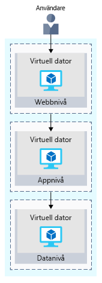

Första steget är sannolikt att återskapa din lokala konfiguration i molnet.

Den här grundläggande konfigurationen ger dig en uppfattning om hur nätverk har konfigurerats och hur nätverkstrafik går in och ut från Azure.

## Kort om din e-handelswebbplats

Större företagssystem består ofta av flera sammankopplade program och tjänster som fungerar tillsammans. Du kan ha ett system för frontend-webbservrar som tar visar lager och kan kunderna skapa en order. Som kan kommunicera med en mängd olika webbtjänster för att tillhandahålla inventeringsdata, hantera användarprofiler, hantering av kreditkort och tjänstbegäranden av bearbetade order.

Det finns flera strategier och mönster som används av programvaruarkitekter och utvecklare att göra det enklare att utforma, skapa, hantera och underhålla dessa komplexa system. Låt oss titta på några av dem, från och med _löst sammansatta arkitekturer_.

### Fördelarna med en löst kopplade arkitektur

> [!VIDEO https://www.microsoft.com/videoplayer/embed/RE2yHrc]

### Med hjälp av en N-tier-arkitektur

Ett arkitekturmönster som kan användas för att bygga löst sammansatta system är _N-nivå_.

En [N-nivåarkitektur](https://docs.microsoft.com/azure/architecture/guide/architecture-styles/n-tier) delar in ett program i två eller flera logiska lager. Arkitektoniskt sett likadant en högre nivå som har åtkomst till tjänster från en lägre nivå, men en lägre nivå bör aldrig åtkomst till en högre nivå.

Nivåerna att avgränsa problem och vi rekommenderar är avsedda att vara återanvändbara. Med hjälp av en skiktad arkitektur förenklar också underhåll. Nivåer kan uppdateras eller ersatts oberoende av varandra och nya nivåer kan infogas om det behövs.

_Med tre nivåer_ anger ett N-nivåprogram med tre nivåer. Ditt e-handelswebbprogram följer den här arkitekturen med tre nivåer:

* Den **webbnivå** ger webbgränssnittet för dina användare via en webbläsare.
* Den **programnivå** körs affärslogik.
* Den **datanivå** innehåller databaser och annat lagringsutrymme som innehåller information och kundens order för produkten.

Följande bild visar flödet av begäran från användaren till datanivån.

När användaren klickar på knappen för att lägga ordern skickas begäran till webbnivån tillsammans med användarens adress och betalningsinformation. Webbnivån skickar denna information till programnivån, som verifierar betalningsinformation och kontrollerar lagret. Appnivån kan sedan lagra ordningen på datanivå som ska hämtas senare för utförande.

## Din e-handelswebbplats som körs på Azure

Azure erbjuder många olika sätt att vara värd för dina webbprogram direkt fullständigt förkonfigurerade miljöer som är värdar för din kod till virtuella datorer som du konfigurerar, anpassa och hantera.

Vi antar att du väljer att köra din e-handelswebbplats på virtuella datorer. Så här kan det se ut i din testmiljö som körs på Azure. Följande bild visar en trelagers-arkitektur som körs på virtuella datorer med säkerhetsfunktioner som är aktiverade för att begränsa inkommande förfrågningar. 

Vi går igenom hur det här fungerar.

### Vad är en Azure-region?

En _region_ är ett Azure-datacenter inom en viss geografisk plats. USA, östra, USA, västra och Europa, norra är exempel på regioner. Som du ser körs programmet i regionen USA, östra.

### Vad är ett virtuellt nätverk?

En _virtuellt nätverk_ är ett logiskt isolerat nätverk på Azure. Virtuella Azure-nätverk är något du känner till om du har konfigurerat nätverk på Hyper-V, VMware eller kanske på andra offentliga moln.

Webb-, program- och datanivåerna har en enskild virtuell dator. Varje virtuell dator tillhör ett virtuellt nätverk.

Användarna interagerar med webbnivån direkt, så den virtuella datorn har en offentlig IP-adress. Användarna interagerar inte med program- eller datanivåerna. Dessa datorer har därför en privat IP-adress.

Azure-datacenter hanterar den fysiska maskinvaran åt dig. Du konfigurerar virtuella nätverk via programvara, vilket gör att du kan hantera ett virtuellt nätverk precis som ditt eget nätverk. Du kan till exempel dela upp ett virtuellt nätverk i undernät för att få bättre kontroll över hur nätverket tilldelar IP-adresser. Du kan också välja vilka nätverk som det virtuella nätverket kan nå, oavsett om det är det offentliga internet eller andra nätverk i det privata IP-adressutrymmet.

### Vad är en nätverkssäkerhetsgrupp?

En _nätverkssäkerhetsgrupp_, eller NSG, tillåter eller avvisar inkommande nätverkstrafik till dina Azure-resurser. Du kan betrakta en nätverkssäkerhetsgrupp som en brandvägg på molnnivå för nätverket.

Till exempel kan du se att den virtuella datorn på webbnivån tillåter inkommande trafik på portarna 22 (SSH) och 80 (HTTP). Varje nätverkssäkerhetsgrupp här tillåter trafik från alla källor. Du kan konfigurera en nätverkssäkerhetsgrupp för att endast acceptera trafik från kända källor, till exempel IP-adresser som du litar på.

> [!NOTE]
> Med port 22 kan du ansluta direkt till Linux-system via SSH. Här visar vi port 22 som öppen i utbildningssyfte. I praktiken kan du konfigurera VPN-åtkomst till ditt virtuella nätverk för att öka säkerheten.

## Sammanfattning

Ditt program med tre nivåer körs nu på Azure i regionen USA, östra. En _region_ är ett Azure-datacenter inom en viss geografisk plats.

Varje nivå kan bara komma åt tjänster från en lägre nivå. Den virtuella datorn som kör på webbnivå har en offentlig IP-adress eftersom det tar emot trafik från internet. De virtuella datorerna i de lägre nivåerna, program- och datanivåer, var och en har privata IP-adresser eftersom de inte kommunicera direkt via internet.

Med _Virtuella nätverk_ kan du gruppera och isolera relaterade system. Du definierar _nätverkssäkerhetsgrupper_ för att styra vilken trafik som kan flöda via ett virtuellt nätverk.

Den konfiguration som du såg här är en bra början. Men när du distribuerar din e-handelswebbplats till produktion i molnet, du kommer troligen stöta samma problem som du gjorde i den lokala distributionen.
