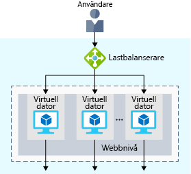
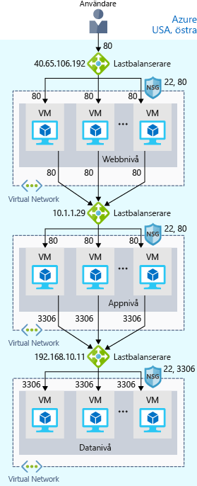
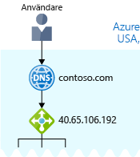

Nu är din webbplats igång på Azure. Men hur kan du se till att din webbplats alltid är igång?

Vad händer till exempel när du behöver utföra veckounderhåll? Tjänsten kommer fortfarande att vara otillgänglig under underhållsperioden. Och eftersom webbplatsen når användare över hela världen finns det ingen bra tidpunkt att ta ned systemen för underhåll. Du kan också stöta på prestandaproblem om för många användare ansluter samtidigt.

## Vad är tillgänglighet och hög tillgänglighet?

:::row:::
  :::column:::
    
  :::column-end:::
    :::column span="3"::: _Tillgänglighet_ innebär hur länge tjänsten är igång utan avbrott. _Hög tillgänglighet_ eller _högt tillgänglig_ avser en tjänst som är igång under lång tid.

Du vet hur frustrerande det är när du inte kommer åt den information du behöver. Tänk på en webbplats för sociala medier eller nyheter som du besöker dagligen. Kommer du alltid åt webbplatsen eller visas ofta felmeddelanden, till exempel ”503 – tjänsten är inte tillgänglig”?
  :::column-end:::
 :::row-end:::

Du kanske har hört uttryck som ”five nines”-tillgänglighet. ”Five nines” (fem nior) innebär att tjänsten garanterat är igång 99,999 procent av tiden. Det är svårt att uppnå 100 procent tillgänglighet, men många team strävar efter minst fem nior.

## Vad är återhämtning?

:::row:::
  :::column:::
    
  :::column-end:::
    :::column span="3"::: _Återhämtning_ avser ett systems förmåga att fortsätta att fungera under avvikande förhållanden.

Exempel på sådana förhållanden:

- Naturkatastrofer.
- Systemunderhåll, både planerat och oplanerat, bland annat programuppdateringar och säkerhetskorrigeringar.
- Toppar i trafiken på webbplatsen.
- Hot från parter med ont uppsåt, till exempel distribuerade överbelastningsattacker (DDoS).
  :::column-end:::
:::row-end:::

Tänk dig att marknadsavdelningen vill ha en blixtrea för att marknadsföra en ny serie vitamintillskott. Du kan förvänta dig en hög topp i trafiken under den här tiden. Den här toppen kan överbelasta bearbetningssystemet, så att det blir långsamt eller stannar helt och dina användare blir besvikna. Du kan ha upplevt den här besvikelsen själv. Har du någonsin försökt komma åt en onlinerea och upplevt att webbplatsen inte svarar?

## Vad är en lastbalanserare?

:::row:::
  :::column:::
    
  :::column-end:::
    :::column span="3"::: En _lastbalanserare_ distribuerar trafik jämt mellan alla system i en pool. Med hjälp av en lastbalanserare kan du uppnå både hög tillgänglighet och återhämtning.

Anta att du börjar med att lägga till ytterligare virtuella datorer, med identisk konfiguration, på varje nivå. Tanken är att ha ytterligare system som är redo om ett blir otillgängligt eller hanterar för många användare samtidigt.
  :::column-end:::
:::row-end:::

Problemet här är att varje virtuell dator har en egen IP-adress. Dessutom går det inte att distribuera trafik om ett system blir otillgängligt eller är upptaget. Hur kopplar du samman de virtuella datorerna så att de visas som ett enda system för användaren?

Lösningen är att använda en belastningsutjämnare för att distribuera trafik. Belastningsutjämnaren blir användarens startpunkt. Användaren vet inte (och behöver inte veta) vilket system lastbalanseraren väljer för att ta emot begäran.

Här är en bild som visar rollen för en lastbalanserare.

Du ser att lastbalanseraren tar emot användarens begäran. Belastningsutjämnaren dirigerar begäran till någon av de virtuella datorerna på webbnivån. Om en virtuell dator inte är tillgänglig eller inte svarar slutar belastningsutjämnaren att skicka trafik till den. Belastningsutjämnaren dirigerar sedan trafik till en av de tillgängliga servrarna.

Med hjälp av belastningsutjämning kan du köra underhållsuppgifter utan att avbryta tjänsten. Du kan exempelvis sprida ut underhållsperioden för alla virtuella datorer. Under underhållsperioden känner belastningsutjämnaren av att den virtuella datorn inte svarar och dirigerar trafik till andra virtuella datorer i poolen.

För din näthandelswebbplats kan app- och datanivåerna också ha en belastningsutjämnare. Det beror helt på vad tjänsten kräver.

## Vad är Azure Load Balancer?

Azure Load Balancer är en tjänst för lastbalansering som Microsoft tillhandahåller vilken hjälper att ta hand om underhållet åt dig.

När du manuellt konfigurerar normal programvara för belastningsutjämning på en virtuell dator finns det en nackdel: nu har du ytterligare ett system som du behöver underhålla. Om lastbalanseraren blir otillgänglig eller kräver rutinunderhåll kommer du tillbaka till det ursprungliga problemet.

Om du istället använder Azure Load Balancer så finns det ingen infrastruktur eller programvara att underhålla.

Följande bild visar rollen för Azure-lastbalanserare i en arkitektur med flera nivåer.

## Hur är det med DNS?

:::row:::
  :::column:::
    
  :::column-end:::
    :::column span="3"::: DNS, eller Domain Name System, är ett sätt att mappa användarvänliga namn till sina IP-adresser. Du kan tänka dig DNS som Internets telefonkatalog.

Domännamnet contoso.com kan till exempel mappas till belastningsutjämnarens IP-adress på webbnivå, 40.65.106.192.

Du kan ta med din egen DNS-server eller använda Azure DNS, en värdtjänst för DNS-domäner som körs på Azure-infrastruktur.
  :::column-end:::
:::row-end:::

Följande bild visar Azure DNS. När användaren navigerar till contoso.com dirigerar Azure DNS trafik till lastbalanseraren.

## Sammanfattning

Med belastningsutjämning har din näthandelswebbplats nu högre tillgänglighet och återhämtning. När du utför underhåll eller när trafiken ökar tillfälligt kan belastningsutjämnaren distribuera trafik till ett annat tillgängligt system.

Du kan konfigurera en egen belastningsutjämnare på en virtuell dator, men Azure Load Balancer minskar behovet av underhåll eftersom det inte finns någon infrastruktur eller programvara att underhålla.

DNS mappar användarvänliga namn till deras IP-adresser, ungefär som en telefonkatalog mappar namn på personer och företag till telefonnummer. Du kan ta med en egen DNS-server eller använda Azure DNS.
