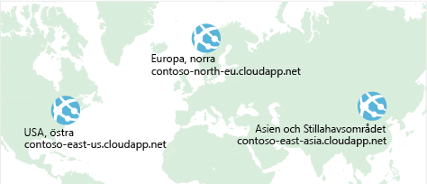

Tidigare såg du hur **Azure Load Balancer** hjälper dig att uppnå hög tillgänglighet och minimera driftstopp.Previously, you saw how **Azure Load Balancer** helps you achieve high availability and minimize downtime.

Även om din e-handelswebbplats är mer tillgänglig löser det problemet med svarstider skapar inte återhämtningsförmåga i olika geografiska områden.Although your e-commerce site is more highly available, it doesn't solve the issue of latency or create resiliency across geographic regions.

Hur kan du göra så att din webbplats, som finns i USA, läses in snabbare för användare i Europa eller Asien?How can you make your site, which is located in the United States, load faster for users located in Europe or Asia?

## Vad är svarstid för nätverk?What is network latency?

:::row:::
  :::column:::
     :::column-end:::: :::column span="3"::: _Svarstid_ innebär den tid det tar för data att överföras via nätverket. :::column-end:::: :::column span="3"::: _Latency_ refers to the time it takes for data to travel over the network. Svarstiden mäts vanligtvis i millisekunder.Latency is typically measured in milliseconds.

Jämför svarstid med bandbredd.Compare latency to bandwidth. Bandbredd är den mängd data som får plats på anslutningen.Bandwidth refers to the amount of data that can fit on the connection. Svarstid är den tid det tar för data att nå sitt mål.Latency refers to the time it takes for that data to reach its destination.
  :::column-end:::
:::row-end:::

Faktorer såsom den typ av anslutning du använder och hur programmet är utformat kan påverka svarstiden.Factors such as the type of connection you use and how your application is designed can affect latency. Men den största faktorn är kanske avståndet.But perhaps the biggest factor is distance.

Ta svarstid din e-handelswebbplats på Azure, som är i regionen USA, östra.Think about your e-commerce site on Azure, which is in the East US region. Det skulle vanligtvis ta kortare tid att överföra data till Atlanta (ett avstånd på cirka 640 km) än att överföra data till London (ett avstånd på cirka 6 400 km).It would typically take less time to transfer data to Atlanta (a distance of around 400 miles) than to transfer data to London (a distance of around 4,000 miles).

Din e-handelswebbplats levererar standard-HTML, CSS, JavaScript och bilder.Your e-commerce site delivers standard HTML, CSS, JavaScript, and images. När det förekommer många filer kan svarstiden för nätverk bli betydande.The network latency for many files can add up. Hur kan du minska svarstiden för användare som är geografiskt långt borta?How can you reduce latency for users located far away geographically?

## Skala ut till olika regionerScale out to different regions

Kom ihåg att Azure tillhandahåller datacenter i regioner över hela världen.Recall that Azure provides data centers in regions across the globe.

:::row:::
  :::column:::
     :::column-end:::: :::column span="3"::: Tänk på kostnaden med att bygga ett datacenter. :::column-end:::: :::column span="3"::: Think about the cost of building a data center. Kostnaderna för utrustning är inte den enda faktorn.Equipment costs aren't the only factor. Du måste se till att det finns el, kylning och personal som håller systemen igång på varje plats.You need to provide the power, cooling, and personnel to keep your systems running at each location. Det kan vara orimligt dyrt att replikera hela datacentret.It might be prohibitively expensive to replicate your entire data center. Men om du gör det med Azure kan det kosta mycket mindre eftersom Azure redan har utrustning och personal på plats.But doing so with Azure can cost much less, because Azure already has the equipment and personnel in place.
  :::column-end:::
:::row-end:::

Ett sätt att minska svarstiden är att tillhandahålla exakta kopior av din tjänst i flera regioner.One way to reduce latency is to provide exact copies of your service in more than one region. Följande bild visar ett exempel på global distribution.The following illustration shows an example of global deployment.

Diagrammet visar din e-handelswebbplats som körs i tre Azure-regioner: USA, östra, Europa, norra och Asien, östra.The diagram shows your e-commerce site running in three Azure regions: East US, North Europe, and East Asia. Lägg märke till DNS-namnet för var och en.Notice the DNS name for each. Hur kan du ansluta användare till den tjänst som ligger närmast geografiskt, men under domänen contoso.com?How can you connect users to the service that's closest geographically, but under the contoso.com domain?

## Använd Traffic Manager för att dirigera användare till den närmaste slutpunktenUse Traffic Manager to route users to the closest endpoint

:::row:::
  :::column:::
     :::column-end:::: :::column span="3"::: Ett svar är **Azure Traffic Manager**. :::column-end:::: :::column span="3"::: One answer is **Azure Traffic Manager**. Traffic Manager använder den DNS-server som är närmast användaren för att dirigera användartrafik till en globalt distribuerad slutpunkt.Traffic Manager uses the DNS server that's closest to the user to direct user traffic to a globally distributed endpoint.
  :::column-end:::
:::row-end:::

Här är en bild som visar rollen för Traffic Manager.The following illustration shows the role of the Traffic Manager.

Traffic Manager ser inte den trafik som skickas mellan klienten och servern.Traffic Manager doesn't see the traffic that's passed between the client and server. I stället dirigerar den klientwebbläsaren till en föredragen slutpunkt.Rather, it directs the client web browser to a preferred endpoint. Traffic Manager kan dirigera trafik på ett par olika sätt, till exempel till slutpunkten med kortast svarstid.Traffic Manager can route traffic in a few different ways, such as to the endpoint with the lowest latency.

Det visas inte här, men den här konfigurationen skulle även kunna innehålla en lokal distribution som körs i Kalifornien.Although not shown here, this setup could also include your on-premises deployment running in California. Du kan ansluta Traffic Manager till dina egna lokala nätverk och dra nytta av befintliga datacenterinvesteringar.You can connect Traffic Manager to your own on-premises networks, enabling you to maintain your existing data center investments. Eller så kan du flytta ditt program helt och hållet till molnet.Or you can move your application entirely to the cloud. Valet är ditt.The choice is yours.

## Jämför Load Balancer med Traffic ManagerCompare Load Balancer to Traffic Manager

:::row:::
  :::column:::
     :::column-end:::: :::column span="3"::: Azure Load Balancer distribuerar trafik inom samma region för att göra dina tjänster mer tillgängliga och tåliga. :::column-end:::: :::column span="3"::: Azure Load Balancer distributes traffic within the same region to make your services more highly available and resilient. Traffic Manager fungerar på DNS-nivå och dirigerar klienten till en önskad slutpunkt.Traffic Manager works at the DNS level, and directs the client to a preferred endpoint. Den här slutpunkten kan vara till den region som ligger närmast dina användare.This endpoint can be to the region that's closest to your user.

Både Load Balancer och Traffic Manager hjälper dig att göra dina tjänster mer motståndskraftiga, men på något olika sätt.Load Balancer and Traffic Manager both help make your services more resilient, but in slightly different ways. När Load Balancer identifierar en virtuell dator som inte svarar dirigerar den trafiken till andra virtuella datorer i poolen.When Load Balancer detects an unresponsive VM, it directs traffic to other VMs in the pool. Traffic Manager övervakar hälsan för dina slutpunkter.Traffic Manager monitors the health of your endpoints. När Traffic Manager hittar en slutpunkt som inte svarar dirigerar den däremot trafiken till nästa närmaste slutpunkt som svarar.In contrast, when Traffic Manager finds an unresponsive endpoint, it directs traffic to the next closest endpoint that is responsive.
  :::column-end:::
:::row-end:::

## SammanfattningSummary

Geografiskt avstånd är en av de största faktorer som bidrar till svarstid.Geographic distance is one of the biggest factors that contributes to latency. Med Traffic Manager på plats kan du hantera exakta kopior av din tjänst i flera geografiska områden.With Traffic Manager in place, you can host exact copies of your service in multiple geographic regions. På så sätt får användare i USA, Europa och Asien en bra upplevelse med hjälp av din e-handelsplats.That way, users in the United States, Europe, and Asia will all have a good experience using your e-commerce site.
