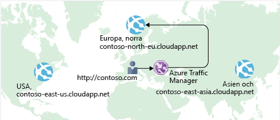

Tidigare såg du hur **Azure Load Balancer** hjälper dig att uppnå hög tillgänglighet och minimera driftstopp.

Även om din e-handelswebbplats är mer tillgänglig löser det problemet med svarstider skapar inte återhämtningsförmåga i olika geografiska områden.

Hur kan du göra så att din webbplats, som finns i USA, läses in snabbare för användare i Europa eller Asien?

## Vad är svarstid för nätverk?

:::row:::
  :::column:::
     :::column-end:::: :::column span="3"::: _Svarstid_ innebär den tid det tar för data att överföras via nätverket. Svarstiden mäts vanligtvis i millisekunder.

Jämför svarstid med bandbredd. Bandbredd är den mängd data som får plats på anslutningen. Svarstid är den tid det tar för data att nå sitt mål.
  :::column-end:::
:::row-end:::

Faktorer såsom den typ av anslutning du använder och hur programmet är utformat kan påverka svarstiden. Men den största faktorn är kanske avståndet.

Ta svarstid din e-handelswebbplats på Azure, som är i regionen USA, östra. Det skulle vanligtvis ta kortare tid att överföra data till Atlanta (ett avstånd på cirka 640 km) än att överföra data till London (ett avstånd på cirka 6 400 km).

Din e-handelswebbplats levererar standard-HTML, CSS, JavaScript och bilder. När det förekommer många filer kan svarstiden för nätverk bli betydande. Hur kan du minska svarstiden för användare som är geografiskt långt borta?

## Skala ut till olika regioner

Kom ihåg att Azure tillhandahåller datacenter i regioner över hela världen.

:::row:::
  :::column:::
     :::column-end:::: :::column span="3"::: Tänk på kostnaden med att bygga ett datacenter. Kostnaderna för utrustning är inte den enda faktorn. Du måste se till att det finns el, kylning och personal som håller systemen igång på varje plats. Det kan vara orimligt dyrt att replikera hela datacentret. Men om du gör det med Azure kan det kosta mycket mindre eftersom Azure redan har utrustning och personal på plats.
  :::column-end:::
:::row-end:::

Ett sätt att minska svarstiden är att tillhandahålla exakta kopior av din tjänst i flera regioner. Följande bild visar ett exempel på global distribution.

Diagrammet visar din e-handelswebbplats som körs i tre Azure-regioner: USA, östra, Europa, norra och Asien, östra. Lägg märke till DNS-namnet för var och en. Hur kan du ansluta användare till den tjänst som ligger närmast geografiskt, men under domänen contoso.com?

## Använd Traffic Manager för att dirigera användare till den närmaste slutpunkten

:::row:::
  :::column:::
     :::column-end:::: :::column span="3"::: Ett svar är **Azure Traffic Manager**. Traffic Manager använder den DNS-server som är närmast användaren för att dirigera användartrafik till en globalt distribuerad slutpunkt.
  :::column-end:::
:::row-end:::

Här är en bild som visar rollen för Traffic Manager.

Traffic Manager ser inte den trafik som skickas mellan klienten och servern. I stället dirigerar den klientwebbläsaren till en föredragen slutpunkt. Traffic Manager kan dirigera trafik på ett par olika sätt, till exempel till slutpunkten med kortast svarstid.

Det visas inte här, men den här konfigurationen skulle även kunna innehålla en lokal distribution som körs i Kalifornien. Du kan ansluta Traffic Manager till dina egna lokala nätverk och dra nytta av befintliga datacenterinvesteringar. Eller så kan du flytta ditt program helt och hållet till molnet. Valet är ditt.

## Jämför Load Balancer med Traffic Manager

:::row:::
  :::column:::
     :::column-end:::: :::column span="3"::: Azure Load Balancer distribuerar trafik inom samma region för att göra dina tjänster mer tillgängliga och tåliga. Traffic Manager fungerar på DNS-nivå och dirigerar klienten till en önskad slutpunkt. Den här slutpunkten kan vara till den region som ligger närmast dina användare.

Både Load Balancer och Traffic Manager hjälper dig att göra dina tjänster mer motståndskraftiga, men på något olika sätt. När Load Balancer identifierar en virtuell dator som inte svarar dirigerar den trafiken till andra virtuella datorer i poolen. Traffic Manager övervakar hälsan för dina slutpunkter. När Traffic Manager hittar en slutpunkt som inte svarar dirigerar den däremot trafiken till nästa närmaste slutpunkt som svarar.
  :::column-end:::
:::row-end:::

## Sammanfattning

Geografiskt avstånd är en av de största faktorer som bidrar till svarstid. Med Traffic Manager på plats kan du hantera exakta kopior av din tjänst i flera geografiska områden. På så sätt får användare i USA, Europa och Asien en bra upplevelse med hjälp av din e-handelsplats.
