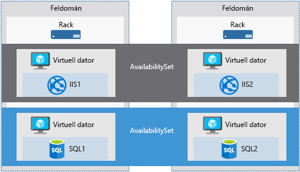

Ett tjänstföretags framgång är ofta direkt relaterad till det serviceavtal företaget har med sina kunder. Kunderna förväntar sig att de tjänster du tillhandahåller alltid är tillgängliga och att deras data alltid är skyddade. Det här är något som Microsoft tar på stort allvar. Azure innehåller verktyg som du kan använda för att hantera tillgänglighet, datasäkerhet och övervakning, så att du vet att dina tjänster alltid är tillgängliga för dina kunder.

Administration av en Azure-dator är inte begränsat till att hantera operativsystem eller program som körs på den virtuella datorn. Det hjälper dig för att veta vilka tjänster som Azure tillhandahåller som garantera tjänstens tillgänglighet och support för automation. Dessa tjänster hjälper dig att planera din organisations affärskontinuitet och haveriberedskap.

Här kan upp vi en Azure-tjänst som hjälper att du förbättra tillgängligheten för virtuella datorer, effektiviserar VM-hanteringsuppgifter och ser till att din VM-data som säkerhetskopieras och säker. Vi börjar med att definiera vad tillgänglighet är.

## Vad är tillgänglighet?

Tillgänglighet är andelen tid i procent som en tjänst är tillgänglig för användning.

Anta att du har en webbplats och att du vill att kunderna ska kunna komma åt informationen hela tiden. Du förväntar dig 100 % tillgänglighet vad gäller åtkomsten till din webbplats.

### Varför behöver jag bry mig om tillgänglighet när jag använder Azure?

Virtuella datorer i Azure körs på fysiska servrar som finns på Microsofts datacenter. Precis som med de flesta fysiska enheter, finns det en risk att det kan finnas ett fel. Om den fysiska servern slutar fungera, kommer även de virtuella datorer som körs på servern att sluta fungera. Om detta inträffar flyttar Azure automatiskt den virtuella datorn till en felfri värdserver. Den här självåterställande migreringen kan emellertid ta flera minuter, och under den perioden är programmet eller programmen som körs på den virtuella datorn inte tillgängliga.

De virtuella datorerna kan också påverkas av regelbundna uppdateringar som initieras av Azure. Dessa underhållshändelser kan gälla allt från programvaruuppdateringar till maskinvaruuppgraderingar och krävs för att förbättra plattformens tillförlitlighet och prestanda. Dessa händelser utförs vanligtvis utan att virtuella gästdatorer påverkas, men ibland behöver de virtuella datorerna startas om för att en uppdatering eller uppgradering ska slutföras.

> [!NOTE]
> Microsoft uppdateras inte automatiskt Virtuellt datorns OS- eller programvara. Du har fullständig kontroll och fullständigt ansvar för det. Den underliggande programvaruvärden och maskinvaran behöver dock korrigeras med jämna mellanrum för att säkerställa hög tillförlitlighet och höga prestanda hela tiden.

För att säkerställa att dina tjänster inte avbryts och undvika en enskild felpunkt, rekommenderar vi för att distribuera minst två instanser av varje virtuell dator. Den här funktionen kallas en _tillgänglighetsuppsättning_.

### Vad är en tillgänglighetsuppsättning?

En **tillgänglighetsuppsättning** är en logisk funktion som används för att se till att en grupp relaterade virtuella datorer distribueras så att de inte alla föremål för en enskild felpunkt och inte alla uppgraderas på samma gång vid en uppgradering av operativsystemet värden i den Datacenter. Virtuella datorer i en tillgänglighetsuppsättning bör utföra en identisk uppsättning funktioner och ha samma programvara installerad.

> [!TIP]
> Microsoft erbjuder ett serviceavtal (SLA) med 99,95 % garanterad extern anslutning för virtuella datorer med flera instanser som distribuerats i en tillgänglighetsuppsättning. Det innebär att för att serviceavtalet ska gälla måste det finnas minst två instanser av den virtuella datorn i en tillgänglighetsuppsättning. 

Du kan skapa tillgänglighetsuppsättningar via Azure Portal i avsnittet om haveriberedskap. Dessutom kan du skapa dem med hjälp av Resource Manager-mallar eller någon av skript eller API-verktyg. När du lägger till virtuella datorer i en tillgänglighetsuppsättning distribuerar Azure dem mellan **feldomäner** och **uppdateringsdomäner**.

#### Vad är en feldomän?

En feldomän är en logisk grupp av maskinvaran i Azure som delar samma strömkälla och nätverksswitch. Den kan liknas vid ett rack i ett lokalt datacenter. De två första virtuella datorerna i en tillgänglighetsuppsättning etableras i två olika rack så att bara en virtuell dator påverkas i händelse av ett fel i nätverket eller ett strömavbrott. Feldomäner definieras även för hanterade diskar som är anslutna till virtuella datorer.

#### Vad är en uppdateringsdomän?

En uppdateringsdomän är en logisk grupp med maskinvara som kan underhållas eller startas om samtidigt. Azure placerar automatiskt tillgänglighetsuppsättningar i uppdateringsdomäner för att minimera effekten när Azure-plattformen introducerar värdoperativsystemsändringar. Azure bearbetar sedan varje uppdateringsdomän en i taget.

Tillgänglighetsuppsättningar är en kraftfull funktion som ser till att de tjänster som körs på dina virtuella datorer alltid är tillgängliga för dina kunder. De är dock inte felsäkra. Vad händer om det uppstår problem med data eller programvaran som körs på den virtuella datorn? För att behöver vi titta i andra haveriberedskap och säkerhetskopiering tekniker.

## Redundansväxling mellan platser

Du kan också replikera din infrastruktur mellan platser för att hantera regional redundans. **Azure Site Recovery** replikerar arbetsbelastningar från en primär plats till en sekundär plats. Om ett avbrott inträffar på den primära platsen kan du växla över till en sekundär plats. Tack vare den här redundansväxlingen kan användarna fortsätta att komma åt dina program utan avbrott. Du kan sedan växla tillbaka till den primära platsen när den är igång och körs igen. Azure Site Recovery handlar om replikering av virtuella eller fysiska datorer. Tjänsten ser till att dina arbetsbelastningar är tillgängliga i händelse av ett avbrott.

Det finns många attraktivt tekniska funktioner till Site Recovery, finns men det minst två viktiga fördelar:

1. Site Recovery kan du använda Azure som mål för återställning, vilket eliminerar kostnaden och komplexiteten med att underhålla ett sekundärt fysiska datacenter.

2. Site Recovery gör det otroligt enkelt att testa redundans för tester utan att påverka produktionsmiljöer. På så vis kan du enkelt testa planerade eller oplanerade redundansväxlingar. Hur vet du om din katastrofåterställningsplan fungerar om du aldrig har provat att redundansväxla?

Återställningsplaner som du skapar med Site Recovery kan vara så enkla eller så komplext som krävs för ditt scenario. De kan innehålla anpassade PowerShell-skript, Azure Automation-runbooks eller manuella åtgärdssteg. Du kan använda återställningsplaner för att replikera arbetsbelastningar till Azure och enkelt dra nytta av nya möjligheter i fråga om migrering, tillfälliga trafiktoppar eller utveckling och testning av nya program.

Azure Site Recovery fungerar med Azure-resurser, eller Hyper-V, VMware och fysiska servrar i din lokala infrastruktur och kan vara en viktig del av din organisations affärskontinuitet och haveriberedskap (BCDR) genom att samordna replikering, redundans och återställning av arbetsbelastningar och program som om den primära platsen misslyckas.
