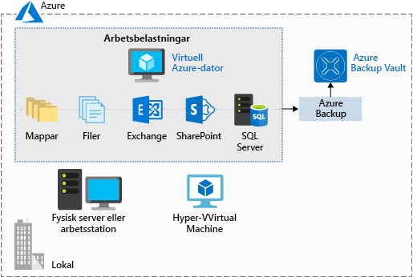

Säkerhetskopiering och återställning är nödvändiga faktorer i planeringen för en god infrastruktur. Kanske förekommer det en bugg som raderar data, eller så behöver du kanske hämta vissa arkiverade data i granskningssyfte. Genom att upprätthålla en bra strategi för säkerhetskopiering ser du till att inte stå tomhänt när data eller programvara behöver återställas.

**Azure Backup** är ett erbjudande för _säkerhetskopiering som en tjänst_ som skyddar fysiska eller virtuella datorer oavsett var de finns: lokalt eller i molnet.

Azure Backup kan användas för en rad olika säkerhetskopieringsscenarier för data, till exempel följande:

- Filer och mappar på datorer med Windows-operativsystemet (fysiska eller virtuella, lokal eller i molnet)
- Programmedvetna ögonblicksbilder (tjänsten Volume Shadow Copy)
- Populära Microsoft Server-arbetsbelastningar som Microsoft SQL Server, Microsoft SharePoint och Microsoft Exchange
- Inbyggt stöd för Azure Virtual Machines, både Windows och Linux
- Linux- och Windows 10-klientdatorer

## Fördelarna med att använda Azure Backup

Traditionella säkerhetskopieringslösningar utnyttjar inte alltid den underliggande Azure-plattformen full ut. Resultatet är en lösning som tenderar att vara dyr eller ineffektiv. Lösningen erbjuder antingen för mycket eller för lite lagring, erbjuder inte rätt typer av lagring eller har besvärliga och utdragna administrativa uppgifter. Azure Backup har utformats för att fungera tillsammans med andra Azure-tjänster och ger flera olika fördelar.

- **Automatisk lagringshantering**. Azure Backup allokerar och hanterar lagringen av säkerhetskopiorna automatiskt och tillämpar en modell där du betalar baserat på din användning. Betala endast för det du använder.

- **Obegränsad skalning**. Azure Backup använder kraften och skalbarheten hos Azure för att leverera hög tillgänglighet.

- **Flera lagringsalternativ**. Azure Backup erbjuder lokalt redundant lagring där alla kopior av data finns i samma region samt geo-redundant lagring där dina data replikeras till en sekundär region.

- **Obegränsad dataöverföring**. Azure Backup begränsar inte hur mycket inkommande eller utgående data du överför. Azure Backup debiterar inte heller för de data som överförs.

- **Datakryptering**. Datakryptering möjliggör säker överföring och lagring av dina data i Azure.

- **Programkonsekvent säkerhetskopiering**. En programkonsekvent säkerhetskopiering innebär att en återställningspunkt har alla data som krävs för att återställa säkerhetskopian. Azure Backup innehåller programkonsekventa säkerhetskopior.

- **Långsiktig kvarhållning**. Azure begränsar inte hur lång tid du behåller säkerhetskopierade data.

## Använda Azure Backup

Azure Backup använder flera komponenter som du laddar ned och distribuerar till varje dator som du vill säkerhetskopiera. Den komponent som du distribuerar beror på vad du vill skydda.

- Azure Backup-agent
- System Center Data Protection Manager
- Azure Backup Server
- Azure Backup VM-tillägg

Azure Backup använder ett Recovery Services-valv för att lagra säkerhetskopierade data. Ett valv backas upp av Azure Storage-blobbar, vilket gör det till ett mycket effektivt och ekonomiskt långsiktigt lagringsmedium. Med valvet på plats väljer du de datorer som ska säkerhetskopieras och definierar en princip för säkerhetskopiering (när ögonblicksbilder tas och hur länge de lagras).