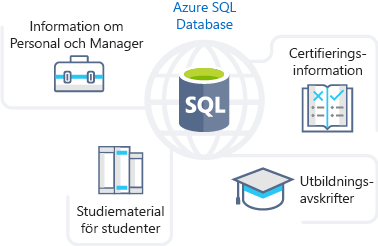
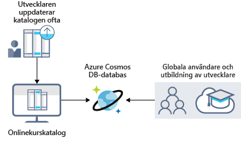
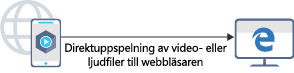
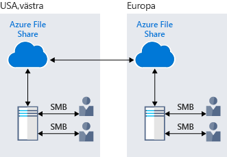
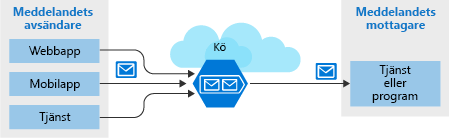
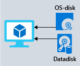

När du tittar på fördelarna med Azure Storage kommer du se att Azure har de bästa alternativen för lagring av din utbildningsportal. Nu ska vi närmare utforska fördelarna och alternativen som finns tillgängliga med Azure Storage för att se hur det passar dina affärsbehov.

## Så kan Azure-lagring uppfylla lagringsbehoven för ditt företag

Azure Storage har flera alternativ som är anpassade för olika typer av datalagring.

### Azure SQL Database

**Azure SQL Database** är en robust, helt hanterad och molnbaserad relationsdatabas som lagrar alla dina data. Du kan använda den här funktionen till att lagra data som du använder och uppdaterar ofta, till exempel personlig och utbildningsrelaterad information om din personal. Du kan också migrera befintliga SQL Server-databaser utan att ändra dina program. Följande bild visar typerna av data från utbildning online portal scenariot som lagras i en Azure SQL database.

### Azure Cosmos DB

Azure Cosmos DB är en globalt distribuerad databastjänst. Funktionen har stöd för data utan schema så att du kan utveckla dynamiska program som *alltid är aktiva*, vilket ger stöd för data som ändras kontinuerligt. Du kan använda den här funktionen för att lagra data som uppdateras och underhålls baserat på indata från användare i hela världen. I följande illustration visas en exempeldatabas för Azure Cosmos DB som används för att lagra data som används av flera personer som finns över hela världen.

### Azure Blob Storage

Med Azure Blob Storage kan du strömma stora video- eller ljudfiler direkt till användarens webbläsare var som helst i världen. Blob Storage används också till att lagra data för säkerhetskopiering och återställning, haveriberedskap och arkivering. Azure Blob Storage kan lagra upp till 8 TB data för virtuella datorer. Följande bild visar ett exempel på användning av Azure blob-lagring.

### Azure Data Lake Storage Gen2

Med funktionen Data Lake i Azure Storage kan du analysera dataanvändningen och skapa rapporter baserat på resultatet. Data Lake är en stor databas för både strukturerade och ostrukturerade data.

**Azure Data Lake Storage Gen2** kombinerar objektlagringens skalbarhet och kostnadsfördelar med Big Data-filsystemens tillförlitlighet och prestanda. Följande bild visar hur Azure Data Lake lagrar dina affärsdata och gör dem tillgängliga för analys.

### Azure Files

Med Azure Files får du helt hanterade filresurser i molnet. Program som körs i Azure kan enkelt dela filer mellan virtuella datorer. Du kan använda Azure-filresurser på samma gång för molnet eller lokala distributioner av Windows, Linux och macOS. Följande bild visar Azure-filer som används för att dela data mellan två geografiska platser. Azure Files använder protokollet Server Message Block (SMB), vilket garanterar att data krypteras i vila och under överföring.

### Azure Queue

Azure Queue Storage är en tjänst för lagring av stora mängder meddelanden som kan nås var som helst i världen. Ett enskilt kömeddelande har en storlek på upp till 64 kB och en kö kan innehålla flera miljoner meddelanden.

Det är oftast en eller flera komponenter av avsändaren och komponenter för en eller flera mottagare. Avsändarkomponenterna lägger till meddelande i kön. Mottagarkomponenter hämtar meddelanden som ligger först i kön för bearbetning. Följande bild visar flera avsändarappar som lägger till meddelanden i Azure-kön och en mottagarapp som hämtar meddelandena.

Queue Storage används främst för följande:

- För att skapa en lista med kvarvarande arbetsuppgifter och för att skicka meddelanden mellan olika Azure-webbservrar.
- För att belastningsutjämna mellan olika webbservrar/infrastrukturer och hantera trafiktoppar.
- För att säkerställa återhämtning efter komponentfel när flera personer använder dina data samtidigt.

### Azure Standard Storage

Virtuella datorer i Azure använder diskar till att lagra operativsystem, program och data. Azure Standard Storage ger ett tillförlitligt och kostnadseffektivt diskstöd för virtuella datorer som kör arbetsbelastningar som inte är verksamhetskritiska. Med Standard Storage lagras data på hårddiskar (HDD).

När du arbetar med virtuella datorer kan du använda SSD-standarddiskar och HDD-standarddiskar för mindre kritiska arbetsbelastningar, och SSD-premiumdiskar för verksamhetskritiska produktionsprogram. Azures diskar har konsekvent levererat tillförlitlighet i företagsklass, med en branschledande årlig felfrekvens på 0 %. Följande bild visar en Azure virtuell dator som använder separata diskar för att lagra andra data.

### Lagringsnivåer

Azure Storage har tre lagringsnivåer för lagring av blobobjekt:

1. **Frekvent lagringsnivå** – Azures frekventa lagringsnivå är optimerad för att lagra data som används ofta. 

1. **Lågfrekvent lagringsnivå** – Azures lågfrekventa lagringsnivå är optimerad för att lagra data som inte används ofta och som lagras i minst 30 dagar.

1. **Arkivlagringsnivå** – arkivlagringsnivån i Azure är optimerad för att lagra data som används sällan och som lagras i minst 180 dagar med flexibla svarstidskrav. Arkivlagring i Azure är perfekt för lagring av äldre versioner av dina data så att du kan hämta dem om det krävs för granskning eller vid andra aktiviteter som inträffar mer sällan.

Följande bild visar Azure Blob Storage-nivåer.

### Kryptering/replikering i Azure Storage

Azure Storage har funktioner för kryptering och replikering som ger hög säkerhet och tillgänglighet för dina data.

#### Kryptering för lagringstjänster

Följande krypteringstyper är tillgängliga för dina resurser:

1. **Azure Storage Service Encryption (SSE)** för data i vila hjälper dig att skydda dina data på ett sätt som uppfyller organisationens krav på säkerhet och regelefterlevnad. Azure SSE krypterar data innan de lagras och dekrypterar data innan de hämtas. Krypteringen och dekrypteringen är transparent för användaren.
1. **Kryptering på klientsidan** är när data redan har krypterats av klientbiblioteken. Azure lagrar data i krypterat tillstånd i vila och dekrypterar sedan när data hämtas.

    Den här krypteringsfunktionen gör att dina data uppfyller globala skyddsstandarder. Den passar bra för lagring av känslig information som personuppgifter och finansiella data.

#### Replikering för tillgänglighet

Replikeringstypen ställs in när du skapar ett lagringskonto. Replikeringsfunktionen garanterar att dina data alltid är tillgängliga. Azure Storage har regionbaserad och geografisk replikering som skyddar dina data mot naturkatastrofer och andra lokala katastrofer som bränder eller översvämningar.
