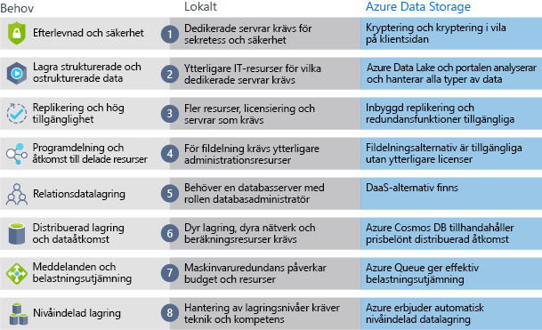

Nu när du vet om fördelarna och funktionerna i Azure datalagring, låt oss se hur den skiljer sig från den lokala lagringen.

Termen ”lokal” syftar på lagring och underhåll av data på lokala maskiner och servrar. Det finns flera faktorer att tänka på när du jämför lokala datalagring för Azure.

## Kostnadseffektivitet
En lokal lagringslösning kräver dedikerad maskinvara som behöver vara köpt, installeras, konfigureras och hanteras. Detta kan vara en betydande direkta kostnad (eller kapitalkostnaden). Ändringen av kraven kan kräva investering i ny maskinvara. Du måste kunna hantera toppar i efterfrågan vilket innebär att den kan vara inaktiva eller att outnyttjade i perioder med låg belastning maskinvaran.

Datalagring för Azure ger en användningsbaserad Prismodell, vilket ofta är tilltalande verksamheter som löpande kostnader i stället för en initiala kapitalkostnader. Det är också skalbart, vilket innebär att du kan skalanpassa lösningen i takt med efterfrågan. Du debiterar endast för de datatjänster du utnyttjar.

## Tillförlitlighet 
Lokal lagring kräver säkerhetskopiering av data, belastningsutjämning och strategier för haveriberedskap. Detta kan vara utmanande och dyrt, och ofta krävs dedikerade servrar som kräver en betydande investering i både maskinvara och IT-resurser.

Azure datalagring tillhandahåller säkerhetskopiering av data, belastningsutjämning, katastrofåterställning och replikering av data som Service för att garantera datasäkerheten och hög tillgänglighet.

## Lagringstyper
Ibland krävs flera olika lagringstyper för en lösning, t.ex fil- och databaslagring. En lokal metod kräver ofta flera servrar och administrativa verktyg för resektive lagringstyp.

Datalagring för Azure erbjuder en mängd olika lagringsalternativ, inklusive distribuerad åtkomst och nivåindelad lagring. Detta gör det möjligt att integrera en kombination av lagringstekniker som ger det bästa lagringsalternativet för varje del av din lösning.

## Flexibilitet
Krav och tekniker ändras. För en lokal distribution kan detta innebära att nya servrar och delar av infrastrukturen måste etableras och distribueras, vilket är både tidskrävande och dyrt.

Datalagring för Azure ger dig möjlighet att skapa nya tjänster på några minuter. Med den här flexibiliteten kan du snabbt ändra lagringsservrar utan att behöva göra någon betydande maskinvaruinvestering.

Följande bild visar skillnaderna mellan en lokal lagring och Azure datalagring.

