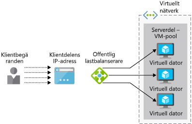
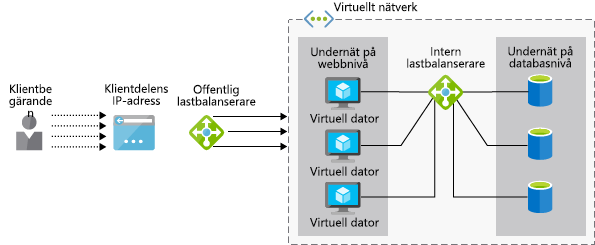

Ditt företag vill se om Azure Load Balancer stöder ditt ERP-program (Enterprise Resource Planning).Your company wants to see if Azure Load Balancer will support your Enterprise Resource Planning (ERP) application. Programmet har ett webbgränssnitt för användare och körs på flera webbservrar.Your application has a web interface for users and runs on multiple web servers. Varje server har en lokal kopia av ERP-databasen som är synkroniserad över alla servrar.Each server has a local copy of the ERP database, which is synced across all servers.

Här tittar vi på hur en lastbalanserare kan hjälpa dig att ge hög tillgänglighet för tjänster.Here, you will look at how a load balancer can help provide high availability of services. Du identifierar skillnaden mellan alternativen Basic- och Standard-lastbalanserare och ser hur du skapar en lastbalanserare för virtuella Azure-datorer.You will identify the difference between the basic and standard load balancer options and see how to create a load balancer for Azure Virtual Machines.

## Vad är lastbalansering?What is load balancing?

_Lastbalansering_ beskriver olika metoder för att distribuera arbetsbelastningar på flera enheter, till exempel beräkning, lagring och nätverk._Load balancing_ describes various techniques for distributing workloads across multiple devices, such as compute, storage, and networking devices. Målet med lastbalansering är att optimera användningen av flera resurser, att använda dessa resurser på det effektivaste sättet när en infrastruktur skalas ut samt att säkerställa att tjänster bevaras om vissa komponenter är inte tillgängliga.The goal of load balancing is to optimize the use of multiple resources, to make the most efficient use of these resources as an infrastructure is scaled out, and to ensure services are maintained if some components are unavailable.

Här går vi igenom stödet för lastbalansering för virtuella datorer (VM) i Azure.Here, we'll look at Azure's load balancing support for virtual machines (VMs).

### Vad är hög tillgänglighet?What is high availability?

Hög tillgänglighet (HA) mäter möjligheten för program eller tjänster att förbli tillgängliga även om det uppstår fel i någon systemkomponent.High availability (HA) measures the ability of an application or service to remain accessible despite a failure in any system component. I det ideala fallet sker ingen märkbar tjänstförlust.Ideally, there will not be any noticeable loss of service.

Lastbalansering är av stor vikt för leverans av hög tillgänglighet eftersom det gör att flera virtuella datorer fungerar som en pool med servrar.Load balancing is fundamental to the delivery of HA because it allows multiple VMs to act as a pool of servers. Poolen kan fortsätta behandla begäranden även om några av de virtuella datorerna kraschar eller tas offline för underhåll.The pool can continue to service requests even if some VMs crash or are taken offline for maintenance.

## Vad är Azure Load Balancer?What is Azure Load Balancer?

**Azure Load Balancer** är en Azure-tjänst som distribuerar inkommande begäranden mellan flera virtuella datorer i en pool.**Azure Load Balancer** is an Azure service that distributes incoming requests across multiple VMs in a pool. Den distribuerar inkommande nätverkstrafik mellan en uppsättning felfria virtuella datorer och undviker alla virtuella datorer som inte kan svara.It distributes incoming network traffic across a set of healthy VMs and avoids any VM that is not able to respond.

 Azure Load Balancer fungerar på lager 4 (TCP, UDP) i OSI:s 7-lagermodell.Azure Load Balancer operates at Layer-4 (TCP, UDP) of the OSI 7-layer model. Den kan konfigureras att stödja TCP- och UDP-tillämpningsscenarier där trafiken är inkommande till virtuella Azure-datorer samt utgående scenarier där andra Azure-tjänster skickar TCP- och UDP-trafik via virtuella Azure-datorer till externa slutpunkter.It can be configured to support TCP and UDP application scenarios where the traffic is inbound to Azure VMs, as well as outbound scenarios where other Azure services are passing TCP and UDP traffic out through Azure VMs to external endpoints.

#### Vad är en lastbalanserare?What is a Load Balancer?

> [!VIDEO https://www.microsoft.com/videoplayer/embed/RE2yBWo]

## Offentliga kontra interna lastbalanserarePublic vs. internal load balancers

En Azure Load Balancer kan vara antingen _offentlig_ eller _intern_ beroende på källan för inkommande begäranden.An Azure Load Balancer can be either _public_ or _internal_ depending on the source of incoming requests.

En **offentlig lastbalanserare** hanterar klientbegäranden som härrör utanför Azure-infrastrukturen.A **public load balancer** handles client requests from outside the Azure infrastructure. Den offentliga IP-adressen är tilldelad till lastbalanseraren och dirigerar de inkommande begärandena till en uppsättning resurser som finns i ett privat virtuellt nätverk.The public IP address is assigned to the load balancer and it routes the inbound requests to a set of resources that are on a private virtual network. Den här metoden används vanligtvis för att skapa webbservrar som har hög tillgänglighet.This approach is commonly used for making web servers highly available. Följande bild visar en offentlig lastbalanserare.The following illustration shows a public load balancer.

En **intern lastbalanserare** bearbetar begäranden som härrör inifrån ett virtuellt nätverk (eller via ett VPN).An **internal load balancer** processes requests from within a virtual network (or through a VPN). Den distribuerar begäranden till resurser inom det virtuella nätverket.It distributes requests to resources within that virtual network. Lastbalanseraren, klientdelens IP-adresser och virtuella nätverk är inte direkt åtkomliga från Internet.The load balancer, front-end IP addresses, and virtual networks are not directly accessible from the Internet. Följande bild visar en arkitektur som innehåller både en offentlig och en intern lastbalanserare.The following illustration shows an architecture containing both a public and internal load balancer. Den offentliga lastbalanseraren hanterar externa begäranden medan den interna lastbalanseraren vidarebefordrar begärandena till de interna virtuella datorerna och databaserna för bearbetning.The public load balancer handles external requests while the internal load balancer forwards the requests to the internal VMs and databases for processing.

## Hur fungerar Azure Load Balancer?How does Azure Load Balancer work?

Azure Load Balancer använder information som konfigureras i _regler_ och _hälsoavsökningar_ för att avgöra hur inkommande trafik som tas emot i lastbalanserarens _klientdel_ ska distribueras till VM-instanser i en _serverdelsadresspool_.Azure Load Balancer uses information configured in _rules_ and _health probes_ to determine how inbound traffic that is received on the load balancer _front end_ is distributed to VM instances in a _backend address pool_. Nu ska vi titta närmare på var och en av dessa komponenter.Let's examine each of these components.

### Vad är lastbalanserarens klientdel?What is the load balancer front end?

Lastbalanserarens klientdel är en IP-konfiguration som innehåller en eller flera offentliga IP-adresser som ger åtkomst till lastbalanseraren och dess program via Internet.The load balancer front end is an IP configuration, containing one or more public IP addresses, that enables access to the load balancer and its applications over the Internet.

### Vad är serverdelsadresspoolen?What is the backend address pool?

Virtuella datorer ansluter till en lastbalanserare med ett virtuellt nätverksgränssnitt (vNIC).Virtual machines connect to a load balancer using their virtual network interface (vNIC). Serverdelsadresspoolen innehåller IP-adresserna för de virtuella nätverkskort som är anslutna till lastbalanseraren.The backend address pool contains the IP addresses of the vNICs that are connected to the load balancer. Om du placerar alla dina virtuella datorer i en tillgänglighetsuppsättning kan du använda detta för att enkelt lägga till de virtuella datorerna i en serverdelspool när du konfigurerar lastbalanseraren.If you place all your VMs in an availability set, you can use this to easily add your VMs to a backend pool when you're configuring the load balancer.

### Vad är en hälsoavsökning?What is a health probe?

Lastbalanserare använder _hälsoavsökningar_ för att avgöra vilka virtuella datorer som kan bearbeta begäranden.Load balancers use _health probes_ to determine which virtual machines can service requests. Lastbalanseraren distribuerar endast trafik till virtuella datorer som är tillgängliga och i drift.The load balancer will only distribute traffic to VMs that are available and operational.

En hälsoavsökning övervakar specifika portar på varje virtuell dator.A health probe monitors specific ports on each VM. Du kan definiera vilken typ av svar som motsvarar ”hälsa”. Du kan till exempel kräva ett `HTTP 200 Available`-svar från ett webbprogram.You can define what type of response corresponds to "health"; for example, you might require an `HTTP 200 Available` response from a web application. Som standard markeras en virtuell dator som ”ej tillgänglig” efter två fel i rad med intervall om 15 sekunder.By default, a VM will be marked as "unavailable" after two consecutive failures at 15-second intervals.

### Regler för lastbalanserareLoad balancer rules

_Regler_ för lastbalanserare definierar hur trafik ska distribueras till de virtuella serverdelsdatorerna.Load balancer _rules_ define how traffic is distributed to backend VMs. Målet är att distribuera begäranden på ett jämnt sätt över de felfria virtuella datorerna i serverdelspoolen.The goal is to distribute requests fairly across the healthy VMs in the backend pool.

Azure Load Balancer använder en hash-baserad algoritm för att skriva om huvudena i inkommande paket.Azure Load Balancer uses a hash-based algorithm to rewrite the headers of inbound packets. Som standard skapar Load Balancer en hash från:By default, Load Balancer creates a hash from:

- Källans IP-adressSource IP address
- KällportSource port
- Mål-IP-adressDestination IP address
- MålportDestination port
- IP-protokollnumretIP protocol number

Den här mekanismen säkerställer att alla paket i ett paketklientflöde skickas till samma VM-serverdelsinstans.This mechanism ensures that all packets within a packet client flow are sent to the same backend VM instance. Ett nytt flöde från en klient använder en annan slumpmässigt tilldelade källport.A new flow from a client will use a different randomly allocated source port. Det innebär att hashen att ändras och lastbalanseraren kan skicka det här flödet till en annan serverdelsslutpunkt.This means that the hash will change, and the load balancer may send this flow to a different backend endpoint.

## Basic kontra Standard lastbalanserar-SKU:erBasic vs. Standard Load Balancer SKUs

Det finns två typer av Azure Load Balancer: **Basic** och **Standard**.There are two versions of Azure Load Balancer: **Basic** and **Standard**. De skiljer sig åt vad gäller skala, funktioner och priser.They differ in scale, features, and pricing. Exempel:For example:

- Standard har stöd för säker trafikroutning via HTTPS.Standard supports secure traffic routing over HTTPS.
- Storleken för serverdelspoolen kan vara mycket större i Standard (1 000 jämfört med 100 i Basic-SKU).Backend pool size can be much larger in Standard (1000 vs. 100 in the Basic SKU).
- Trafiken kan dirigeras till en större pool med slutpunkter, inklusive överlappande skalningsuppsättningar, tillgänglighetsuppsättningar och virtuella datorer.Traffic can be directed to a larger pool of endpoints, including blends of scale sets, availability sets, and VMs. Basic-SKU:n är begränsad till en enda tillgänglighetsuppsättning, skalningsuppsättning eller virtuell dator.The Basic SKU  is restricted to a single availability set, scale set, or VM.
- Stöd för portar med hög tillgänglighet (HA-portar) att belastningsutjämna TCP- och UDP-flöden på alla portar samtidigt som du använder den som en intern lastbalanserare.Support for High Availability (HA) ports to load-balance TCP and UDP flows on all ports simultaneously when you're using it as an internal load balancer.
- Basic är kostnadsfritt medan Standard debiteras baserat på regler och dataflöde.Basic is no-cost, while Standard is charged based on rules and throughput.

Standard är en överordnad uppsättning av Basic, så alla scenarier som är lämpliga för Basic bör även fungera med Standard.Standard is a superset of Basic, so any scenario suitable for Basic should also work on Standard. Basic-SKU:n är generellt avsedd för prototyper och testning medan Standard rekommenderas för produktion.The Basic SKU is generally intended for prototyping and testing while Standard is recommended for production.

## Starta distributionen av en offentlig Basic-lastbalanserareStart the deployment of a basic public load balancer

För att skapa ett lastbalanserat virtuellt datorsystem behöver du skapa själva lastbalanseraren, skapa ett virtuellt nätverk som ska innehålla dina virtuella datorer och sedan lägga till de virtuella datorerna till det virtuella nätverket.To create a load-balanced VM system, you need to create the load balancer itself, create a virtual network to contain your virtual machines, and then add VMs to the virtual network.

För att skapa lastbalanseraren med hjälp av Azure-portalen definierar du följande:To create the load balancer using the Azure portal, you define the following:

- Lastbalanserarens namnLoad balancer name
- Typ: offentlig eller internType: public or internal
- SKU: Basic eller StandardSKU: Basic or Standard
- Offentlig IP-adress: dynamisk eller statiskPublic IP address: dynamic or static
- Resursgrupp och platsResource group and location

De virtuella serverdelsdatorerna kommer alla att vara anslutna till samma virtuella nätverk så nästa steg är att konfigurera den här resursen:Your backend VMs will all be connected to the same virtual network, so you need to configure this resource next:

- Virtuellt nätverksnamnVirtual network name
- Det adressutrymme som ska användas, till exempel 172.20.0.0/16Address space to use, such as 172.20.0.0/16
- ResursgruppResource group
- Namn för det undernät som ska användasName for the subnet to use
- Adressutrymmet för undernätet (måste vara inom huvudutrymmet), till exempel 172.20.0.0/24Address space for the subnet (must be within the main space), such as 172.20.0.0/24

Eftersom vi förväntar oss inkommande trafik måste vi skapa några nätverkssäkerhetsregler med hjälp av en nätverkssäkerhetsgrupp (NSG).Since we expect inbound traffic, we'll have to create some network security rules using a network security group (NSG). I det här fallet vill vi öppna port 80 för HTTP-trafik.In this case, we'll want to open port 80 for HTTP traffic.

Till sist behöver vi skapa och distribuera de virtuella datorerna och konfigurera dem till att använda ditt virtuella nätverk.Finally, we then need to create and deploy the virtual machines and configure them to use your virtual network. Vi ska även skapa en tillgänglighetsuppsättning som grupperar ihop dem.We will also create an availability set to group them together. Tillgänglighetsuppsättningar definierar nivån av feltolerans för en grupp med virtuella datorer, men för lastbalansering hjälper de dig även att tilldela dina virtuella datorer till serverdelspooler.Availability sets define the level of fault tolerance across a group of VMs, but for load balancing, they also help you assign your VMs to backend pools.

Du har nu sett hur du använder Azure Load Balancer som en del av en lösning för hög tillgänglighet.You have now seen how to use Azure Load Balancer as part of a high-availability solution. Härnäst använder du dessa steg för att distribuera din egen lastbalanserare.Next, you will use these steps to deploy your own load balancer.