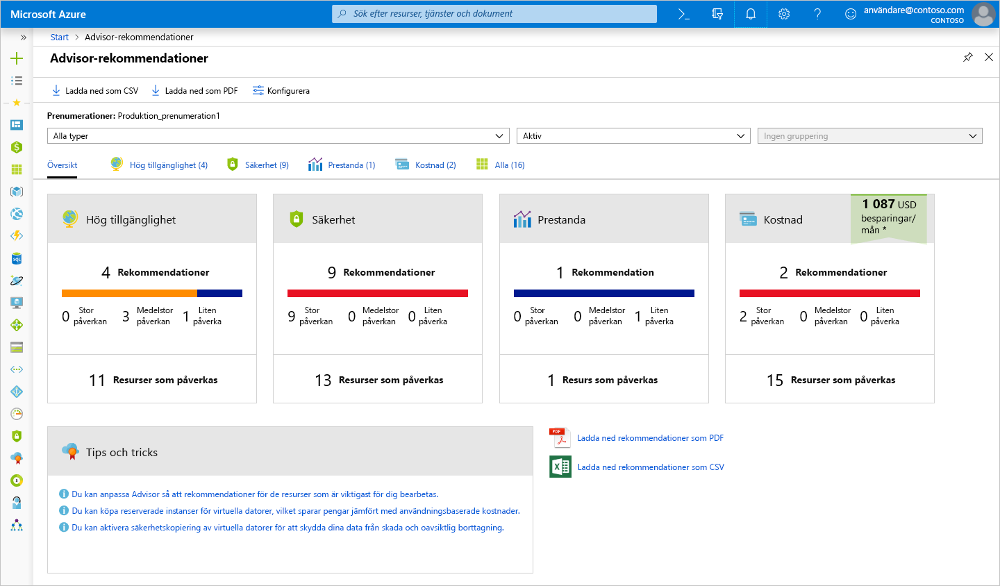
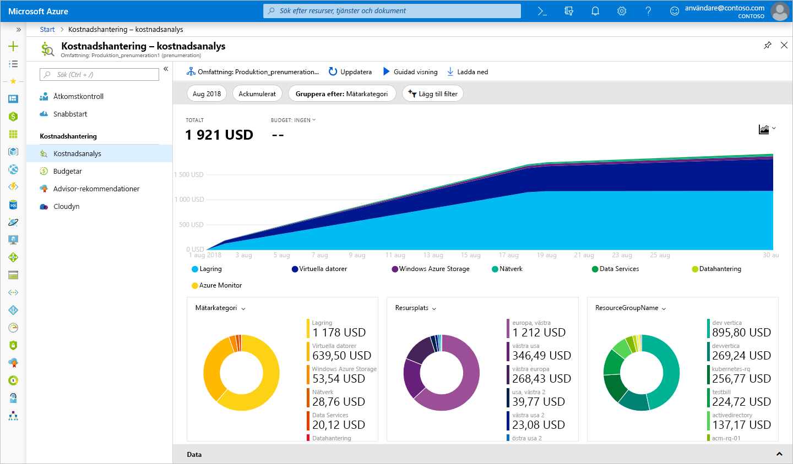
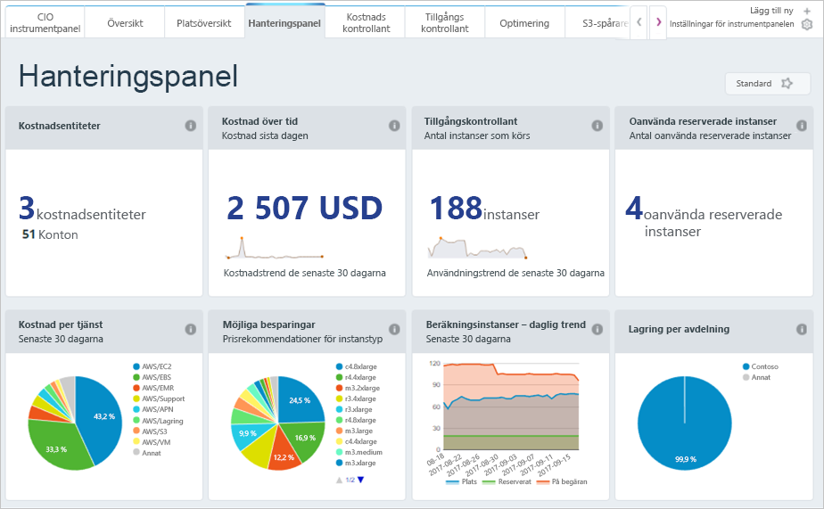

Vi har lärt oss hur du uppskattar dina kostnader innan du distribuerar tjänster i Azure, men hur gör du med resurser som redan har distribuerats?We learned how to estimate your costs before you deploy services on Azure, but what if you already have resources deployed? Hur kan du få insyn i de kostnader du redan ådrar dig?How do you get visibility into the costs you're already accruing? Om vi hade distribuerat den tidigare lösningen till Azure, hur kan vi då se till att de virtuella datorerna har rätt storlek och se hur stor fakturan kommer att bli?If we had deployed our previous solution to Azure and now want to make sure that we've sized the virtual machines properly and predict how much our bill will be, how can we do this? Nu ska vi titta på några verktyg i Azure som kan lösa det här problemet.Let's look at a few tools on Azure that you can use to help you solve this problem.

## Vad är Azure Advisor?What is Azure Advisor?

**Azure Advisor** är en kostnadsfri tjänst i Azure som ger rekommendationer om hög tillgänglighet, säkerhet, prestanda och kostnader.**Azure Advisor** is a free service built into Azure that provides recommendations on high availability, security, performance, and cost. Advisor analyserar dina distribuerade tjänster och söker efter sätt att optimera miljön med avseende på de här områdena.Advisor analyzes your deployed services and looks for ways to improve your environment across those four areas. Här fokuserar vi på kostnadsrekommendationer, men du bör även ta en titt på de andra rekommendationerna.We'll focus on the cost recommendations, but you'll want to take some time to review the other recommendations as well.

Advisor ger kostnadsrekommendationer inom följande områden:Advisor makes cost recommendations in the following areas:

1. **Minska kostnaderna genom att eliminera avetablerade Azure ExpressRoute-kretsar.****Reduce costs by eliminating unprovisioned Azure ExpressRoute circuits.**
    Den här processen identifierar ExpressRoute-kretsar som haft providerstatusen *Inte etablerad* i mer än en månad, och du rekommenderas att ta bort kretsen om du inte planerar att etablera den hos din anslutningsprovider.This identifies ExpressRoute circuits that have been in the provider status of *Not Provisioned* for more than one month and recommends deleting the circuit if you aren't planning to provision the circuit with your connectivity provider.

1. **Köpa reserverade instanser, vilket sparar pengar jämfört med användningsbaserad betalning.****Buy reserved instances to save money over pay-as-you-go.**
    Den här processen granskar din användning av virtuella datorer under de senaste 30 dagarna i syfte att se om du kan spara pengar i framtiden genom att köpa reserverade instanser.This will review your virtual machine usage over the last 30 days and determine if you could save money in the future by purchasing reserved instances. Advisor visar i vilka regioner och för vilka storlekar du potentiellt kan spara mest pengar, samt hur mycket du skulle kunna spara genom att köpa reserverade instanser.Advisor will show you the regions and sizes where you potentially have the most savings and will show you the estimated savings you might achieve from purchasing reserved instances.

1. **Ange rätt storlek för eller stänga ner underutnyttjade virtuella datorer.****Right-size or shutdown underutilized virtual machines.**
    Den här processen övervakar din användning av virtuella datorer under 14 dagar och identifierar de datorer som används lite.This monitors your virtual machine usage for 14 days and then identifies underutilized virtual machines. Virtuella datorer vars genomsnittliga processoranvändning är 5 % eller mindre och vars nätverksanvändning är 7 MB eller mindre under minst fyra dagar anses vara virtuella datorer med låg användning.Virtual machines whose average CPU utilization is 5 percent or less and network usage is 7 MB or less for four or more days are considered underutilized virtual machines. Tröskelvärdet för genomsnittlig processoranvändning kan justeras upp till 20 procent.The average CPU utilization threshold is adjustable up to 20 percent. När du har identifierat de här virtuella datorerna kan du bestämma dig för att ändra storlek på dem vilket minskar dina kostnader.By identifying these virtual machines, you can decide to resize them to a smaller instance type, reducing your costs.

[!include]

Nu ska vi se var du hittar Azure Advisor i portalen.Let's take a look at where you can find Azure Advisor in the portal. 

1. Logga in på [Azure-portalen](https://portal.azure.com?azure-portal=true) med ditt Microsoft-konto.Sign into the [Azure portal](https://portal.azure.com?azure-portal=true) using your Microsoft account. 

1. Klicka på **Alla tjänster**. I kategorin **Hanteringsverktyg** ser du **Advisor**.Click on **All Services**, and in the **Management Tools** category, you will see **Advisor**. Du kan också skriva `Advisor` i filtreringsrutan så att du bara filtrerar på just den tjänsten.You can also type `Advisor` in the filter box to filter on just that service.

1. Om du klickar på Advisor visas instrumentpanelen för Advisor-rekommendationer där du kan se alla rekommendationer för din prenumeration.Click on Advisor, and you'll be taken to the Advisor recommendations dashboard where you can see all the recommendations for your subscription. Du ser en ruta för varje kategori med rekommendationer.You'll see a box for each category of recommendations.

> [!NOTE]
> Du kanske inte har några rekommendationer kring kostnader i Advisor.You might not have any recommendations on cost in Advisor. Det här kan bero på att utvärderingarna inte är färdiga ännu, eller helt enkelt på att Advisor inte har några rekommendationer att ge.This could be because assessments have not yet completed or simply because Advisor has no recommendations.

När du klickar på **Kostnad** visas detaljerad information om rekommendationerna i Advisor.Clicking on the **Cost** box will take you to detailed recommendations where you can see the recommendations that Advisor has.

Om du klickar på en rekommendation visas detaljerad information om rekommendationen i fråga.Clicking on any recommendation will take you to the details for that specific recommendation. Sedan kan du utföra en specifik åtgärd, till exempel minska kostnaderna genom att ändra storlek på virtuella datorer.Then you'll be able to take a specific action, such as resizing virtual machines to reduce spending.

De här rekommendationerna gäller områden där du kanske spenderar pengar ineffektivt.These recommendations are all places where you might be inefficiently spending money. De är ett bra ställe att börja och komma tillbaka till när du letar efter sätt att minska dina kostnader.They're a great place to start and continue to revisit when looking for places to reduce costs. I vårt exempel kan vi spara ungefär 700 dollar per månad genom att följa rekommendationerna.In our example, there's an opportunity for us to save around $700 per month if we take these recommendations. Sådana besparingar blir betydande med tiden, så gör det till en vana att kontrollera rekommendationerna inom alla fyra områden regelbundet.This savings adds up, so be sure to review this periodically for recommendations across all four areas.

## Azure Cost ManagementAzure Cost Management

Azure Cost Management är ett annat kostnadsfritt verktyg i Azure som du kan använda till att få bättre insikt i vart dina pengar tar vägen i molnet.Azure Cost Management is another free, built-in Azure tool that can be used to gain greater insights into where your cloud money is going. Du kan se historiska genomgångar av vilka tjänster du spenderar pengar på och hur utgifterna står sig mot de budgetar du har angett.You can see historical breakdowns of what services you are spending your money on and how it is tracking against budgets that you have set. Du kan ange budgetar, schemalägga rapporter och analysera kostnadsområden.You can set budgets, schedule reports, and analyze your cost areas.

## CloudynCloudyn

Cloudyn är ett dotterbolag till Microsoft som låter dig spåra molnanvändning och utgifter för dina Azure-resurser, och för andra molnproviders som Amazon Web Services och Google.Cloudyn, a Microsoft subsidiary, allows you to track cloud usage and expenditures for your Azure resources and other cloud providers including Amazon Web Services and Google. Instrumentpanelsrapporter som är lätta att förstå hjälper dig med kostnadsallokering och återbetalningar.Easy-to-understand dashboard reports help with cost allocation and chargebacks. Cost Management hjälper dig att optimera molnutgifterna genom att identifiera underutnyttjade resurser som du sedan kan hantera och anpassa.Cost Management helps optimize your cloud spending by identifying underutilized resources that you can then manage and adjust. Användningen för Azure är kostnadsfri, och det finns betalda alternativ för premiumsupport och visning av data från andra moln.Usage for Azure is free, and there are paid options for premium support and to view data from other clouds.

Som du ser finns det flera kostnadsfria verktyg i Azure som du kan använda till att spåra och förutse dina molnutgifter, och se vilka delar i miljön som är ineffektiva ur ett kostnadsperspektiv.As you can see, there are several tools available for no cost on Azure that you can use to track and predict your cloud spend and identify where your environment may be inefficient from a cost perspective. Gör det till en vana att granska rapporterna och rekommendationerna i de här verktygen regelbundet så att du kan sänka dina kostnader i molnet.You'll want to make sure you make it a regular practice to review the reports and recommendations that these tools make available, so you can unlock savings across your cloud footprint.