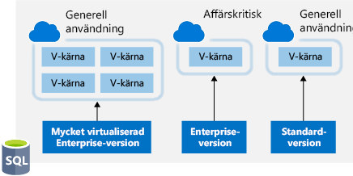
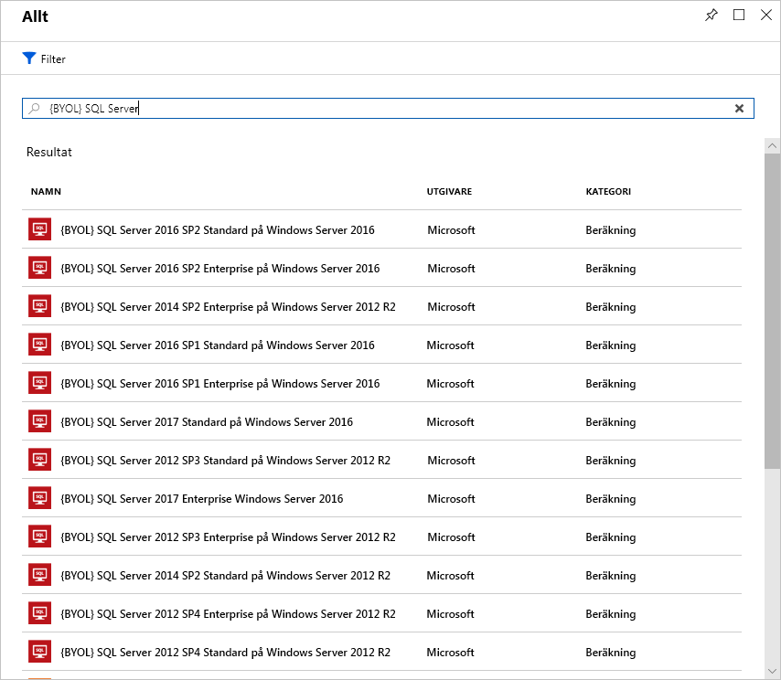

Licensiering är ett annat område som kan ha stor inverkan på dina utgifter.Licensing is another area that can dramatically impact your cloud spending. Nu ska vi titta på några sätt att sänka dina licenskostnader.Let's look at some ways you can reduce your licensing costs.

## Azure Hybrid-förmånen för Windows ServerAzure Hybrid Benefit for Windows Server

Många kunder har investerat i Windows Server-licenser och vill kunna dra nytta av den här investeringen i Azure.Many customers have made an investment in Windows Server licenses and would like to repurpose this investment on Azure. Azure Hybrid-förmånen ger kunderna rätt att använda dessa licenser för virtuella datorer i Azure.The Azure Hybrid Benefit gives customers the right to use these licenses for virtual machines on Azure. Det innebär att du inte debiteras för Windows Server-licensen utan istället betalar Linux-priset.That means you won't be charged for the Windows Server license and will instead be billed at the Linux rate.

För att få tillgång till den här förmånen måste dina Windows-licenser omfattas av Software Assurance.To be eligible for this benefit, your Windows licenses must be covered by Software Assurance. Följande riktlinjer gäller också:The following guidelines will also apply:

- Varje licens för två processorer eller varje uppsättning licenser för 16 kärnor är berättigade till två instanser med upp till 8 kärnor eller en instans med upp till 16 kärnor.Each two-processor license or each set of 16-core licenses is entitled to two instances of up to 8 cores or one instance of up to 16 cores.
- Standard Edition-licenser kan bara användas en gång, antingen lokalt eller i Azure.Standard Edition licenses can only be used once either on-premises or in Azure. Det innebär att du inte kan använda samma licens för en virtuell Azure-dator och en lokal dator.That means you can't use the same license for an Azure VM and a local computer.
- Datacenter Edition-förmånen innebär att du kan använda licenser både lokalt och i Azure samtidigt, så licensen täcker två aktiva Windows-datorer.Datacenter Edition benefits allow for simultaneous usage both on-premises and in Azure, so the license will cover two running Windows machines.

> [!NOTE]
> De flesta av våra kunder använder licenser per kärna, så använd den modellen i dina beräkningar.Most customers are typically licensed by core, so you'll use that model for your calculation. Om du har frågor om vilka licenser du har kan du kontakta din återförsäljare för licenser eller ditt kontoteam hos Microsoft.If you have questions about what licenses you have, reach out to your license reseller or your Microsoft account team.

Det är enkelt att använda förmånen.Applying the benefit is easy. Du kan aktivera och inaktivera den när som helst för befintliga virtuella datorer eller tillämpa den när nya virtuella datorer distribueras.It can be turned on and off at any time with existing VMs or applied at deployment time for new VMs. Hybrid-förmånen (särskilt när den kombineras med reserverade instanser) kan ge betydligt lägre licensutgifter.The Hybrid Benefit (especially when combined with reserved instances) can provide substantial license savings.

## Azure Hybrid-förmånen för SQL ServerAzure Hybrid Benefit for SQL Server

Azure Hybrid-förmånen för SQL Server hjälper dig att få ut mesta möjliga värde från nuvarande licensinvesteringar och låter dig migrera till molnet snabbare.The Azure Hybrid Benefit for SQL Server helps you maximize the value from your current licensing investments and accelerate your migration to the cloud. Azure Hybrid-förmånen för SQL Server är en Azure-baserad förmån som gör att du kan använda dina SQL Server-licenser med aktiv Software Assurance och då betala en lägre avgift.Azure Hybrid Benefit for SQL Server is an Azure-based benefit that enables you to use your SQL Server licenses with active Software Assurance to pay a reduced rate.

Du kan använda den här förmånen även om Azure-resursen är aktiv, men det reducerade priset tillämpas från när du väljer det i portalen.You can apply this benefit even if the Azure resource is active, but the reduced rate will be applied from the time you select it in the portal. Krediter utfärdas inte retroaktivt.No credit will be issued retroactively.

### Alternativ för virtuella kärnor i Azure SQL DatabaseAzure SQL Database vCore-based options

Azure Hybrid-förmånen fungerar så här för Azure SQL Database:For Azure SQL Database, the Azure Hybrid Benefit works as follows:

- Om du har Standard Edition-licenser per kärna med aktiv Software Assurance kan du få en virtuell kärna på servicenivån General Purpose för varje licenskärna du äger lokalt.If you have Standard Edition per core licenses with active Software Assurance, you can get one vCore in the General Purpose service tier for every one license core you own on-premises.
- Om du har Enterprise Edition-licenser per kärna med aktiv Software Assurance kan du få en virtuell kärna på servicenivån Business Critical för varje licenskärna du äger lokalt.If you have Enterprise Edition per core licenses with active Software Assurance, you can get one vCore in the Business Critical service tier for every one license core you own on-premises. Observera att Azure Hybrid-förmånen för SQL Server på servicenivån Business Critical bara är tillgänglig för kunder som har Enterprise Edition-licenser.Note that the Azure Hybrid Benefit for SQL Server for the Business Critical service tier is available only to customers who have Enterprise Edition licenses.
- Om du har starkt virtualiserade Enterprise Edition-licenser per kärna med aktiv Software Assurance kan du få fyra virtuella kärnor på servicenivån General Purpose för varje licenskärna du äger lokalt.If you have highly virtualized Enterprise Edition per core licenses with active Software Assurance, you can get four vCores in the General Purpose service tier for every one license core you own on-premises. Det här är en unik virtualiseringsförmån som endast är tillgänglig för Azure SQL Database.This is a unique virtualization benefit available only on Azure SQL Database.

Följande illustration visar de alternativ för virtuella kärnor som är tillgängliga på varje tjänstnivå med Azure Hybrid-förmånen för SQL Server-licenser.The following illustration shows the vCore-based options available in each service tier with Azure Hybrid Benefit for SQL Server licenses.

För SQL Server i Azure Virtual Machines fungerar Azure Hybrid-förmånen så här:For SQL Server in Azure Virtual Machines, the Azure Hybrid Benefit works as follows:

- Om du har Enterprise Edition-licenser per kärna med aktiv Software Assurance kan du få en kärna med SQL Server Enterprise Edition i Azure Virtual Machines för varje licenskärna du äger lokalt.If you have Enterprise Edition per core licenses with active Software Assurance, you can get one core of SQL Server Enterprise Edition in Azure Virtual Machines for every one license core you own on-premises.
- Om du har Standard Edition-licenser per kärna med aktiv Software Assurance kan du få en kärna med SQL Server Standard Edition i Azure Virtual Machines för varje licenskärna du äger lokalt.If you have Standard Edition per core licenses with active Software Assurance, you can get one core of SQL Server Standard Edition in Azure Virtual Machines for every one license core you own on-premises.

Det här kan ha stor inverkan på dina Azure-utgifter för SQL Server-arbetsbelastningar.This can make a dramatic impact on your Azure spending with SQL Server workloads.

## Använda prenumerationserbjudanden för utveckling/testningUse Dev/Test subscription offers

Erbjudandena [Enterprise Dev/Test](https://azure.microsoft.com/offers/ms-azr-0148p/) och [Betala per användning – utveckling/testning](https://azure.microsoft.com/offers/ms-azr-0023p/) är en förmån som du kan använda för att spara pengar på miljöer som inte används i produktion.The [Enterprise Dev/Test](https://azure.microsoft.com/offers/ms-azr-0148p/) and [Pay-As-You-Go Dev/Test](https://azure.microsoft.com/offers/ms-azr-0023p/) offers are a benefit you can take advantage of to save costs on your non-production environments. De här förmånerna ger dig flera rabatter, särskilt för Windows-arbetsbelastningar. Du betalar inga licensavgifter och faktureras endast Linux-priset för virtuella datorer.This benefit gives you several discounts, most notably for Windows workloads, eliminating license charges and only billing you at the Linux rate for virtual machines. Det här gäller även SQL Server och andra Microsoft-program som täcks under en prenumeration på Visual Studio (kallades tidigare för MSDN).This also applies to SQL Server and any other Microsoft software that is covered under a Visual Studio subscription (formerly known as MSDN). 

Det finns några krav för att den här förmånen ska gälla. Den gäller bara för arbetsbelastningar utanför produktion, och användare i de här miljöerna (förutom testare) måste täckas under en Visual Studio-prenumeration.There are a few requirements for this benefit, one being that it's only for non-production workloads, and another being that any users of these environments (excluding testers) must be covered under a Visual Studio subscription. För arbetsbelastningar utanför produktionsmiljö kan du alltså sänka dina kostnader för Windows, SQL Server och andra virtuella Microsoft-datorer.In short, for non-production workloads, this allows you to save money on your Windows, SQL Server, and other Microsoft virtual machine workloads.

Nedan kan du läsa fullständig information om respektive erbjudande.Below are the full details of each offer. Om du är en kund med ett Enterprise-avtal skulle du använda erbjudandet Enterprise Dev/Test, och om du är en kund utan Enterprise-avtal som använder PAYG-konton skulle du använda erbjudandet Betala per användning – utveckling/testning.If you are a customer on an Enterprise Agreement, you'd leverage the Enterprise Dev/Test offer, and if you are a customer without an Enterprise Agreement and are instead using PAYG accounts, you'd leverage the Pay-As-You-Go Dev/Test offer.

## Använd din egen SQL Server-licensBring your own SQL Server license

Om du är en kund med ett Enterprise-avtal och redan har investerat i SQL Server-licenser, som sedan har frigjorts när du flyttat resurser till Azure, kan du etablera **BYOL-avbildningar** (använd din egen licens) från Azure Marketplace. Då får du användning för dina licenser och minskar kostnaden för dina virtuella Azure-datorer.If you are a customer on an Enterprise Agreement and already have an investment in SQL Server licenses, and they have freed up as part of moving resources to Azure, you can provision **bring your own license** (BYOL) images off the Azure Marketplace, giving you the ability to take advantage of these unused licenses and reduce your Azure VM cost. Du har alltid kunnat göra det här genom att etablera en virtuell Windows-dator och installera SQL Server manuellt, men när du använder certifierade avbildningar från Microsoft blir processen enklare.You've always been able to do this by provisioning a Windows VM and manually installing SQL Server, but this simplifies the creation process by leveraging Microsoft certified images. Sök efter **BYOL** på Marketplace om du vill hitta de här avbildningarna.Search for **BYOL** in the Marketplace to find these images.

> [!IMPORTANT]
> Du behöver en Enterprise Agreement-prenumeration för att använda de här certifierade BYOL-avbildningarna.An Enterprise Agreement subscription is required to use these certified BYOL images.

## Använda SQL Server Developer EditionUse SQL Server Developer Edition

Det är många som inte känner till att SQL Server Developer Edition är en kostnadsfri produkt **när den inte används i produktion**.A lot of people are unaware that SQL Server Developer Edition is a free product for **nonproduction use**. Developer Edition har samma funktioner som Enterprise Edition, men för miljöer utanför produktion. Det här gör att du kan sänka dina licenskostnader avsevärt.Developer Edition has all the same features that Enterprise Edition has, but for nonproduction workloads, you can save dramatically on your licensing costs.

Leta efter SQL Server-avbildningar för Developer Edition på Azure Marketplace och använd dem för utveckling eller testning. Då eliminerar du den extra kostnaden för SQL Server i de här fallen.Look for SQL Server images for Developer Edition on the Azure Marketplace and use them for development or testing purposes to eliminate the additional cost for SQL Server in these cases.

> [!TIP]
> Mer information finns i [dokumentationen om prissättning](https://docs.microsoft.com/azure/virtual-machines/windows/sql/virtual-machines-windows-sql-server-pricing-guidance).For full licensing information, take a look at the [documented pricing guidance](https://docs.microsoft.com/azure/virtual-machines/windows/sql/virtual-machines-windows-sql-server-pricing-guidance).

## Använda begränsade instansstorlekar för databasarbetsbelastningarUse constrained instance sizes for database workloads

Många kunder har stora krav på minne, lagring och I/O-bandbredd, men ett litet antal processorkärnor.Many customers have high requirements for memory, storage, or I/O bandwidth but low CPU core counts. På grund av detta så har Microsoft gjort de mest populära storlekarna (DS, ES, GS och MS) tillgängliga i nya storlekar där antalet kärnor begränsas till hälften eller en fjärdedel av den ursprungliga VM-storleken, men med samma mängd minne lagring och I/O-bandbredd.Based on this popular request, Microsoft has made available the most popular VM sizes (DS, ES, GS, and MS) in new sizes that constrain the vCPU count to one half or one quarter of the original VM size, while maintaining the same memory, storage, and I/O bandwidth.

| Storlek på virtuell datorVM Size | Virtuella processorervCPUs | MinneMemory | Maximalt antal diskarMax disks | Maximalt I/O-dataflödeMax I/O throughput | Licenskostnad för SQL Server Enterprise per årSQL Server Enterprise licensing cost per year | Total kostnad per år (databehandling och licenser)Total cost per year (compute + licensing) |
|---------|-------|--------|-----------|--------------------|-----------------------------------------------|---------------------------|
| Standard_DS14v2Standard_DS14v2   | 1616 | 112 GB112 GB | 3232 | 51 200 IOPS eller 768 MB/s51,200 IOPS or 768 MB/s |           |           |
| Standard_DS14-4v2Standard_DS14-4v2 | **4****4**  | 112 GB112 GB | 3232 | 51 200 IOPS eller 768 MB/s51,200 IOPS or 768 MB/s | 75 % lägre75% lower | 57 % lägre57% lower |
| Standard_GS5Standard_GS5      | 3232 | 448448    | 6464 | 80 000 IOPS eller 2 MB/s80,000 IOPS or 2 GB/s   |           |           |
| Standard_GS5-8Standard_GS5-8    | **8****8**  | 448448    | 6464 | 80 000 IOPS eller 2 MB/s80,000 IOPS or 2 GB/s   | 75 % lägre75% lower | 42 % lägre42% lower |

Eftersom databasprodukter som SQL Server och Oracle licensieras per processor så kan kunderna sänka sina licenskostnader med upp till 75 procent och samtidigt få tillgång till de databasprestanda som behövs.Because database products like SQL Server and Oracle are licensed per CPU, this allows customers to reduce licensing cost by up to 75 percent but still maintain the high performance their database requires.