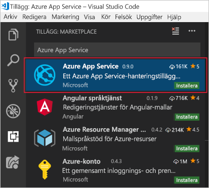

Om du vill använda Visual Studio Code för Azure-utveckling måste du installera Visual Studio Code lokalt och en eller flera Azure-tillägg. I den här övningen lägger vi till tillägget **Azure App Service**.

## <a name="install-visual-studio-code"></a>Installera Visual Studio Code

::: zone pivot="windows"

### <a name="windows"></a>Windows

1. [Ladda ned Visual Studio Code-installationsprogrammet för Windows](https://code.visualstudio.com/).

1. Kör installationsprogrammet.

1. Öppna Visual Studio Code genom att trycka på Windows-tangenten eller genom att klicka på Windows-ikonen i aktivitetsfältet och skriv ”Visual Studio Code” och klicka på resultatet **Visual Studio Code**.

::: zone-end

::: zone pivot="macos"

### <a name="macos"></a>macOS

1. [Ladda ned Visual Studio Code för macOS](https://code.visualstudio.com/).

1. Dubbelklicka på det nedladdade arkivet för att visa innehållet.

1. Dra Visual Studio-Code.app till mappen Program.

1. Öppna Visual Studio Code genom att klicka på ikonen för App-delen eller genom att söka efter Visual Studio Code i Spotlight.

::: zone-end

::: zone pivot="linux"

### <a name="linux"></a>Linux 

#### <a name="debian-and-ubuntu"></a>Debian och Ubuntu

1. Ladda ned och installera [.deb paketet (64-bitars)](https://go.microsoft.com/fwlink/?LinkID=760868) via det grafiska programvarucentret, eller via kommandoraden (om tillgängligt) (ersätt `<file>` med det .deb-filnamn som du laddade ned):

    ```bash
    sudo dpkg -i <file>.deb
    sudo apt-get install -f # Install dependencies
    ```

#### <a name="rhel-fedora-and-centos"></a>RHEL, Fedora och CentOS

1. Använd följande skript för att installera nyckeln och databasen:

    ```bash
    sudo rpm --import https://packages.microsoft.com/keys/microsoft.asc
    sudo sh -c 'echo -e "[code]\nname=Visual Studio Code\nbaseurl=https://packages.microsoft.com/yumrepos/vscode\nenabled=1\ngpgcheck=1\ngpgkey=https://packages.microsoft.com/keys/microsoft.asc" > /etc/yum.repos.d/vscode.repo'
    ```

1. Uppdatera paketcachen och installera paketet med dnf (Fedora 22 och senare):

    ```bash
    dnf check-update
    sudo dnf install code
    ```

#### <a name="opensuse-and-sle"></a>openSUSE och SLE

1. Yum-lagringsplatsen fungerar även för openSUSE- och SLE-baserade system. Följande skript installerar nyckeln och databasen:

    ```bash
    sudo rpm --import https://packages.microsoft.com/keys/microsoft.asc
    sudo sh -c 'echo -e "[code]\nname=Visual Studio Code\nbaseurl=https://packages.microsoft.com/yumrepos/vscode\nenabled=1\ntype=rpm-md\ngpgcheck=1\ngpgkey=https://packages.microsoft.com/keys/microsoft.asc" > /etc/zypp/repos.d/vscode.repo'
    ```

1. Uppdatera paketcachen och installera paketet med:

    ```bash
    sudo zypper refresh
    sudo zypper install code
    ```

> [!NOTE]
> Mer information om hur man installerar eller uppdaterar Visual Studio Code på olika Linux-distributioner finns under avsnittet om hur man [kör Visual Studio Code i Linux-dokumentation](https://code.visualstudio.com/docs/setup/linux).

::: zone-end

## <a name="install-azure-app-service-extension"></a>Installera tillägget för Azure App Service

1. Öppna Visual Studio Code om du inte redan har gjort det.

1. Öppna webbläsartillägget som går att hitta via menyn till vänster.

1. Sök efter **Azure App Service**.

1. Välj resultatet **Azure App Service** och klicka på **Installera**.

    Följande skärmbild visar Azure App Service-tillägget som valts i sökresultaten för Visual Studio Code-tillägget.

    

Detta installerar tillägget. Nu är du redo att ansluta till din Azure-prenumeration och distribuera en webb-, mobil- eller API-app till en Azure App Service-tjänst.
