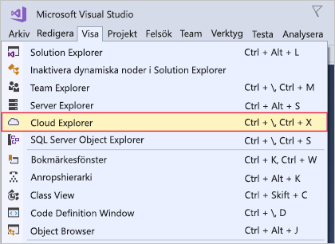

Här ska du installera Visual Studio på antingen en Windows- eller macOS-dator.Here, you'll install Visual Studio on either your Windows or your macOS development machine.

## ÖvningsstegExercise steps

::: zone pivot="windows"::: zone pivot="windows"

### WindowsWindows

1. Hämta installationsprogrammet för Visual Studio från https://visualstudio.microsoft.com/downloads/.Download the Visual Studio installer from https://visualstudio.microsoft.com/downloads/.

1. Kör installationsprogrammet.Run the installer.

1. I fliken **Arbetsbelastning**, välj arbetsbelastningen **Azure- utveckling**.On the **Workloads** tab, select the **Azure development** workload.

    Följande skärmbild visar den arbetsbelastning för installationsprogrammet för Visual Studio som har valts för Azure-utveckling i Visual Studio.The following screenshot shows the Visual Studio Installer workload selected to allow Azure development within Visual Studio.

    

1. (Valfritt) Installera utvecklingsarbetsbelastningar för ASP.NET och webbutveckling för att kunna skapa webbprogram för Azure.(Optional) Install the ASP.NET and web development workload to be ready to create web applications for Azure.

1. Klicka på **Installera** och vänta tills Visual Studio är installerat.Click **Install**, and wait for Visual Studio to install. För system där Visual Studio redan har installerats kan det stå **Ändra** på den här knappen.For systems with Visual Studio already installed, this button may say **Modify**.

1. Öppna Visual Studio när installationen är klar.When the installation is complete, open Visual Studio.

1. Gå till menyn Visa i Visual Studio och kontrollera att du har alternativet **Cloud Explorer**.Go to the View menu in Visual Studio and make sure you have the **Cloud Explorer** option.

    Följande skärmbild visar menyalternativet Cloud Explorer som är tillgängligt om du har installerat arbetsbelastningen Azure Development.The following screenshot shows the Cloud Explorer menu option that will be present if you have the Azure development workload installed.

    

::: zone-end::: zone-end

::: zone pivot="macos"::: zone pivot="macos"

### macOSmacOS

1. Gå till https://visualstudio.microsoft.com/ och hämta installationsprogrammet för att installera Visual Studio för Mac.Go to https://visualstudio.microsoft.com/ and download the Visual Studio for Mac installer.

1. Klicka på VisualStudioInstaller.dmg-filen för att montera installationsprogrammet och kör det sedan genom att dubbelklicka på logotypen.Click the VisualStudioInstaller.dmg file to mount the installer, then run it by double-clicking the logo.

1. Bekräfta sekretess- och licensvillkoren när de visas.Acknowledge the Privacy and License terms when presented.

1. Installationsprogrammet kommer fråga vilka komponenter du vill installera.The installer will ask which components you wish to install. Azure-komponenter ingår redan i Visual Studio för Mac, men du rekommenderas att installera **.NET Core**-plattformen för att utveckla webbfunktioner för Azure.Azure components are already part of Visual Studio for Mac, but it is recommended to install the **.NET Core** platform to develop web experiences for Azure.

    Följande skärmbild visar den .NET Core-plattform som krävs för att lägga till funktioner för Azure-utveckling i Visual Studio för Mac.The following screenshot shows the .NET Core platform required to add Azure development capabilities to Visual Studio for Mac.

    

1. Klicka på **Installera och uppdatera** när du är nöjd med dina val och vänta tills installationsprogrammet är klart.Click **Install and Update** once you are happy with the selections, and wait for the installer to complete.

1. Om du uppmanas höja behörighetsnivån kan du använda dina administratörsautentiseringsuppgifter för att göra detta.If you are prompted to elevate the permissions needed, use your administrator credentials to do so.

1. När installationsprogrammet är klart kan du starta Visual Studio för Mac.Once the installer is complete, start Visual Studio for Mac.

::: zone-end::: zone-end