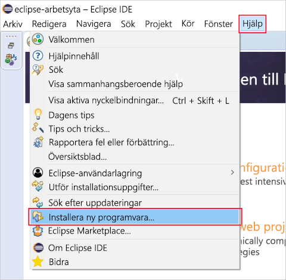

Här installerar du Eclipse och Azure Toolkit på en utvecklingsdator.Here you'll install Eclipse and the Azure Toolkit on your development machine. I slutet av övningen har du allt du behöver för att skapa ett Java-program som är anslutet till Azure.By the end of the exercise, you'll have everything you need to create a Java application connected to Azure.

## Installera Eclipse IDEInstall Eclipse IDE

1. Ladda ned lämplig [Eclipse IDE för ditt operativsystem](https://www.eclipse.org/downloads/packages/installer).Download the appropriate [Eclipse IDE for your operating system](https://www.eclipse.org/downloads/packages/installer).

1. Starta installationsprogrammet för Eclipse när det har hämtats.Start the Eclipse installer once downloaded.

    1. I Windows dubbelklickar du på den nedladdade filen.On Windows, double-click the downloaded file.

    1. I macOS och Linux packar du upp installationsprogrammet från den nedladdade filen och kör det.On macOS and Linux, unzip the installer from the downloaded file and run it.

        > [!NOTE]
        > Du kan uppmanas att installera Java Development Kit om det saknas.The installer may prompt you to install the Java Development Kit, if it is missing.

1. Välj de paket som ska installeras.Select the packages to install. Om du är Java-utvecklare väljer du alternativet Java eller Java EE Eclipse IDE.For Java developers, choose either the Java or Java EE Eclipse IDE option.

1. Välj installationsmålet på din dator.Select the installation destination on your machine.

1. Starta Eclipse för att kontrollera att det har installerats korrekt.Launch Eclipse to validate that it installed correctly.

## Installera Azure Toolkit for EclipseInstall Azure Toolkit for Eclipse

Azure Toolkit installeras på samma sätt i Windows, macOS och Linux.Installing the Azure Toolkit is the same across Windows, macOS, and Linux.

1. Starta Eclipse.Start Eclipse.

1. Gå till **Hjälp** > **Installera ny programvara...**.Go to **Help** > **Install New Software...**.

    På följande skärmbild visas menyplatsen för alternativet **Installera ny programvara...**.The following screenshot shows the menu location of the **Install New Software...** item.

    

1. Dialogrutan **Tillgänglig programvara** öppnas.The **Available Software** dialog will open. Gå till textrutan **Arbeta med:**, skriv `http://dl.microsoft.com/eclipse/` och tryck på Retur.In the **Work with:** text box, type `http://dl.microsoft.com/eclipse/` and press Enter.

1. Markera alternativet **Azure Toolkit för Java** i resultatet.In the results, check the **Azure Toolkit for Java** option. Avmarkera alternativet **Kontakta alla uppdateringsplatser under installationen för att hitta nödvändig programvara** om det inte redan är avmarkerat.Make sure you uncheck the **Contact all update sites during install to find required software** option, if it isn't already.

    Följande skärmbild visar installationskonfigurationen **Tillgänglig programvara** som beskrivs ovan.The following screenshot shows the **Available Software** install configuration as described above.

    

1. Klicka på **Nästa**.Click **Next**.

1. Granska och acceptera licensavtalet när du uppmanas att göra det och klicka sedan på **Slutför**.Review and accept the license agreements when prompted, and click **Finish**.

1. Eclipse laddar ned och installerar Azure Toolkit.Eclipse will download and install the Azure Toolkit.

1. Starta om Eclipse om det behövs.Restart Eclipse if required.

1. Verifiera installationen av Azure Toolkit genom att kontrollera att menyalternativet **Verktyg** > **Azure** visas i Eclipse.Validate the Azure Toolkit installation by verifying that you can find a **Tools** > **Azure** menu option in Eclipse.
