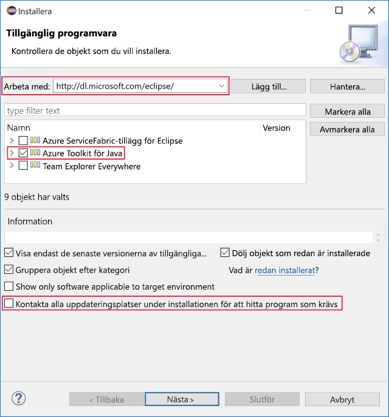

I den här enheten installerar du Eclipse och Azure-verktygen på den lokala datorn. Installationen går snabbt och enkelt. I slutet av den här övningen kommer du har allt du behöver för att skapa ditt första Java-program på Azure.

## Installera Eclipse IDE

1. Hämta Eclipse-versionen för ditt operativsystem från http://www.eclipse.org/downloads/packages/installer.

1. Starta installationsprogrammet för Eclipse när det har hämtats.

    1. I Windows dubbelklickar du på den nedladdade filen.

    1. Packa upp installationsprogrammet från den hämta filen och kör det på macOS och Linux.

        > [!NOTE]
        > Du kan uppmanas att installera Java Development Kit om det saknas.

1. Välj de paket som ska installeras. Om du är Java-utvecklare väljer du alternativet Java eller Java EE Eclipse IDE.

1. Välj installationsmålet på din dator.

1. Starta Eclipse för att kontrollera att det har installerats korrekt.

## Installera Azure Toolkit for Eclipse

Azure Toolkit installeras på samma sätt i Windows, macOS och Linux.

1. Starta Eclipse.

1. Gå till **Hjälp** > **Installera ny programvara...**.

    På följande skärmbild visas menyplatsen för alternativet **Installera ny programvara...**.

    

1. Dialogrutan **Tillgänglig programvara** öppnas. Gå till textrutan **Arbeta med:**, skriv `http://dl.microsoft.com/eclipse/` och tryck på Retur.

1. Markera alternativet **Azure Toolkit för Java** i resultatet. Avmarkera alternativet **Kontakta alla uppdateringsplatser under installationen för att hitta nödvändig programvara** om det inte redan är avmarkerat.

    Följande skärmbild visar installationskonfigurationen **Tillgänglig programvara** som beskrivs ovan.

    

1. Klicka på **Nästa**.

1. Granska och acceptera licensavtalet när du uppmanas att göra det och klicka sedan på **Slutför**.

1. Eclipse laddar ned och installerar Azure Toolkit.

1. Starta om Eclipse om det behövs.

1. Verifiera Azure Toolkit-installationen genom att verifiera som du hittar en **verktyg** > **Azure** menyalternativet i Eclipse.

## Sammanfattning

I den här enheten, installerat Eclipse och förberett den för att dra nytta av integrering med Azure-tjänster och produkter.