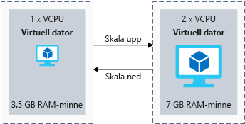

Din server måste ha tillräckligt med resurser för att hantera dagliga begäran. En typisk strategi är att välja en VM-storlek när du skapar räcker för typiska arbetsbelastningar och sedan ändra storlek på den när behoven ändras.

Den här strategin är användbart för att hantera resurser för din medellång sikt tillväxt Sonens företagets för scenariot. Du kan öka storleken på den virtuella datorn ska hantera har lagts till belastningen när verksamheten växer.

## <a name="what-is-virtual-machine-size"></a>Vad är VM-storlek?

Den _storlek_ är ett mått på dess processor, minne, disk och förväntade nätverkets bandbredd för en virtuell dator. Virtuella datorer är tillgängliga i ett förinställt antal storlekar. Till exempel den **Standard_F32s_v2** storleken har 32 virtuella processorer, 64 GiB minne, en 256 GiB lokal SSD-lagring och 14 000 Mbit/s förväntade nätverksbandbredden.

När du skapar en ny virtuell dator i Azure måste du välja en storlek. Större storlekar kostar mer. Målet är att välja en storlek som kan hantera din arbetsbelastning utan att konfigurera mer än du behöver.

## <a name="what-is-virtual-machine-type"></a>Vad är en typ av virtuell dator?

Den _typ_ är arbetsbelastningen som den virtuella datorn har optimerats för en virtuell dator. Vissa virtuella datorer riktas till exempel processorintensiva uppgifter, t.ex. som är värd för en webbserver. Andra är avsedda för storage-fokuserade jobb som att köra en databas.

Det finns _typer_ som motsvarar varje core maskinvarukomponent i en modern dator: **compute**, **minne**, **storage**, och  **GPU**. Det finns också en **generella** skriver om du behöver en belastningsutjämnade kombination av resurser. I följande tabell visas typerna och storlekar som är en del av varje typ, tillsammans med en kort beskrivning av arbetsbelastningen mål.

|Typ|Storlekar|Beskrivning|
|---|---|---|
|Generell användning|B, Ds_v3, D_v3, some DS_v2, some D_v2, A_v2|Allmänna datorer har ett balanserat förhållande för CPU och minne. Allmänna datorer är bra för servrar testning eller utveckling, små till mellanstora databaser och webbservrar med låg till medelhög trafik.|
|Beräkningsoptimerad|Fs_v2, Fs, F|Beräkningsoptimerade virtuella datorer har högre CPU och minne förhållande än allmänna datorer för uppgifter som kräver extra processorkraft, till exempel programservrar, nätverksenheter eller webbservrar med medelhög trafik.|
|Minnesoptimerad|Es_v3, E_v3, M, GS, G, some DS_v2, some D_v2|Minnesoptimerade virtuella datorer har en hög minne att CPU-förhållande. Dessa datorer är bra för relationsdatabasservrar, servrar som kräver eller utföra en massa cachelagring eller servrar som utför minnesinterna analyser.|
|Lagringsoptimerad|Ls|Dessa virtuella datorer är konfigurerade för högt diskgenomflöde och i/o-åtgärder som passar stordata, SQL, och NoSQL-databaser.|
|GPU|NV, NC, NC_v2, NC_v3, ND|GPU-datorer är särskilt utformade för uppgifter som tung grafisk rendering och videoredigering, tillsammans med modellen utbildnings- och inferensjobb (ND-serien) med djupinlärning. Du kan välja en eller flera GPU: er för dessa datorer.|
|Databehandling med höga prestanda|H|Den snabbaste, är mest kraftfulla processorerna tillgängliga i dessa virtuella datorer. Du kan också lägga till nätverksgränssnitt för stora dataflöden (RDMA).|

## <a name="clusters"></a>Kluster

Fysisk maskinvara i Azure-regioner är grupperade i kluster. Varje kluster har stöd för flera olika virtuella datorstorlekar baserat på den fysiska maskinvaran.

När du skapar en virtuell dator och välja en viss storlek, etableras den virtuella datorn till en lämplig maskinvara-kluster i den aktuella storleken. Även om du kan ändra storlek på virtuella datorer när du har skapat, kan storleksändring alternativen begränsas av maskinvara-kluster som valts för den ursprungliga storleken.

## <a name="what-is-vertical-scaling"></a>Vad är vertikal skalning?

_Vertikal skalning_ är processen att ändra den _storlek_ för en virtuell dator. Du kan _skala upp_ genom att välja en kraftfullare storlek för att hantera ökad efterfrågan eller _Nedskalning_ att allokera färre resurser och minska kostnaderna. Följande bild visar ett exempel på att ändra storlek på en virtuell dator.



Du kan ändra storlek på en virtuell dator med Azure-portalen, Azure PowerShell eller Azure CLI.

### <a name="resize-in-the-portal"></a>Ändra storlek på i portalen

I Azure-portalen, du kan ändra storlek på en virtuell dator genom att välja den virtuella datorn, klicka på den **storlek** posten och välja en post från den **väljer du en storlek** bladet. 

Om den virtuella datorn körs när beror de tillgängliga storlekar som du kan välja på tillgängliga storlekar i din region. Du ser bara ändra storlek på alternativ som är kompatibel med samma maskinvara kluster som den virtuella datorn körs för tillfället. Detta kallas ibland en *storlek familj*. Om du väljer en ny storlek för medan den virtuella datorn körs, kommer den virtuella datorn startas om automatiskt om du vill tillämpa den nya storleken.

Om storleken du letar efter inte visas i portalen när den virtuella datorn körs, kan du stänga av den virtuella datorn för att se fler alternativ. När datorn är i den **Stoppad (frigjord)** systemtillstånd, kommer du att kunna välja storlekar från annan maskinvara i samma region.

### <a name="resize-with-powershell"></a>Ändra storlek på med PowerShell

Du kan använda PowerShell för att utföra vertikal skalning interaktivt eller med skript. Skript är bra för avancerade scenarier; till exempel om du vill ändra storlek på flera virtuella datorer samtidigt. De är också praktiskt om du vill ändra storleken vid ledig tid för att undvika störningar för användaren.

Följande cmdlet visar en lista över storlekar för Virtuella datorer i samma storlek-familjen som den aktuella maskinvaran:

```PowerShell
Get-AzureRmVMSize -ResourceGroupName "myResourceGroup" -VMName "MyVM"
```

Om önskad storlek visas, använder du följande cmdlet ändrar storleken på virtuella datorn:

```PowerShell
$vm = Get-AzureRmVM -ResourceGroupName "myResourceGroup" -VMName "MyVM"
$vm.HardwareProfile.VmSize = "<newVMsize>"
Update-AzureRmVM -VM $vm -ResourceGroupName "myResourceGroup"
```

Om önskad storlek inte visas med den dator som kör kan du använda följande kommandon för att frigöra den virtuella datorn, ändra storlek på datorn och starta datorn igen:

```PowerShell
Stop-AzureRmVM -ResourceGroupName "myResourceGroup" -Name "MyVM" -Force
$vm = Get-AzureRmVM -ResourceGroupName "myResourceGroup" -VMName "MyVM"
$vm.HardwareProfile.VmSize = "<newVMSize>"
Update-AzureRmVM -VM $vm -ResourceGroupName "myResourceGroup"
Start-AzureRmVM -ResourceGroupName "myResourceGroup" -Name "MyVM"
```

Virtuella datorer i Azure kan ändras efter behov för att öka prestanda eller minska kostnaderna. Utför storleksändringen manuellt, med portalen eller ett skript, är det bra att referensen gradvis tillväxten eller när du vet om en ändring i begäran förbereds i förväg. I scenario Sonens företagets skala de upp innan helgdagar att hantera toppar i efterfrågan och skala sedan ned efteråt.
