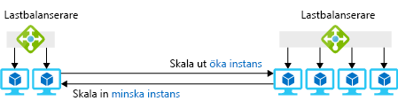
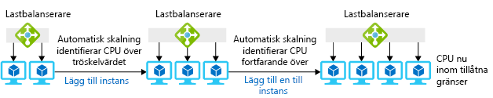

Du kan få de resurser du behöver med hjälp av antingen en stor virtuell dator eller flera små virtuella datorer med en lastbalanserare för att distribuera begäranden mellan de virtuella datorerna.

VM-poolen har en bra fördel i att du kan lägga till eller ta bort virtuella datorer snabbt när behoven ändras. För scenariot med leksaksföretaget vore den här strategin användbar för att hantera oväntade toppar i efterfrågan. Du skulle kunna lägga till virtuella datorer till poolen när efterfrågan ökar och ta bort dem när begäran återgår till det normala. Poolen ger dig även redundans; om en virtuell dator slutar fungera kan de andra fortsätta att hantera begäranden utan avbrott i tjänsten.

I det här avsnittet får du se hur det går till att etablera flera virtuella datorer med hjälp av skalningsuppsättningar och automatiskt lägga till och ta bort instanser som svar på förändrade behov. 

## Vad är horisontell skalning?

*Horisontell skalning* är en process för att lägga till eller ta bort virtuella datorer från en pool för att justera mängden tillgängliga resurser. Att lägga till datorer kallas att _skala ut_, och att ta bort datorer kallas att _skala in_. Lösningar som använder horisontell skalning omfattar en lastbalanserare eller en gateway för att distribuera begäranden mellan de virtuella datorerna i poolen. Följande bild visar ett exempel på att ändra antalet instanser av virtuella datorer.

Den här tekniken fungerar bäst för program som kan köras på flera identiska servrar. Till exempel kan du duplicera webbservern och webbplatserna på flera virtuella datorer, så ger de alla samma svar oavsett vilken server som tar emot begäran. Å andra sidan är en virtuell dator som kör serverdelsdatabasen inte en den optimala lösningen eftersom körning av flera kopior av databasen kräver en del arbete för att hålla kopiorna synkroniserade.

## Vad är en skalningsuppsättning?

En *skalningsuppsättning* är en uppsättning identiska virtuella datorer, en lastbalanserare eller en gateway för att distribuera begäranden samt en valfri uppsättning regler som styr när virtuella datorer läggs till eller tas bort från poolen. Här innebär ”identiska” att varje virtuell dator i uppsättningen skapas med hjälp av samma avbildning och har samma storlek.

Det finns en viss flexibilitet vad gäller att konfigurera en ny virtuell dator med den programvara som du behöver. Du kan börja med en fördefinierad avbildning för det grundläggande operativsystemet och använda skript för att installera eller kopiera filer automatiskt när operativsystemet har konfigurerats. Du kan även skapa en anpassad virtuell datoravbildning med operativsystemet där din programvara redan är installerad.

## Så distribuerar du begäranden

Du kan använda antingen en lastbalanserare eller en Application Gateway för att distribuera begäranden till VM-instanserna i en skalningsuppsättning.

En Azure-lastbalanserare fungerar med OSI-lager 4 (TCP och UDP) och dirigerar trafik baserat på källans IP-adress och port i kombination med målets IP-adress och port. Den kan ge tillhörighet där trafiken från samma IP-källadress dirigeras till samma målserver för att skapa konsekvens i en klientsession. Lastbalanseraren har även en hälsoavsökningsmekanism som fastställer tillgängligheten för serverinstanser. Om en virtuell dator slutar svara på hälsoavsökningen undviker lastbalanseraren att dirigera nya anslutningar till den datorn.

En Application Gateway fungerar på OSI-lager 7 (programlagret). Om dina virtuella datorer till exempel kör en webbserver kan gatewayen använda begärd URL för att utföra dirigering. Det innebär att du kan vidarebefordra begäranden med `*/customers*` i URL:en till en pool med servrar och begäranden med `*/partners*` i URL:en till en annan pool. Application Gateway kan även tillhandahålla HTTP-till-HTTPS-omdirigering, Secure Sockets Layer-avslutning (SSL) för att minska bearbetningskravet på de virtuella datorerna för kryptering samt en brandvägg för webbaserade program (WAF) som använder regler för att identifiera kända webbkryphål och förhindra att dessa begäranden når webbservrarna.

## Vad är autoskalning?

_Autoskalning_ är att automatiskt skala in eller ut baserat på en uppsättning regler. Reglerna kan utlösas av datorbelastning eller av ett schema. Följande bild visar hur funktionen för autoskalning hanterar instanser för att klara av belastningen.

Om du vill aktivera autoskalning för en skalningsuppsättning behöver du skapa en autoskalningsprofil. Profilen definierar det lägsta och högsta antalet VM-instanser för uppsättningen och skalningsreglerna. Regler för autoskalning har följande element:

* Måttkälla – källan för information eller data som utlöser regeln för autoskalning. Det finns fyra alternativ:
  * *Aktuell skalningsuppsättning* ger värdbaserade mått som inte kräver ytterligare agenter.
  * *Lagringskonto* – Azure-diagnostiktillägget skriver prestandamått till Azure-lagring som används för att utlösa regler för autoskalning.
  * *Service Bus-kö* kan ange programbaserade eller andra Azure Service Bus-meddelanden för att utlösa autoskalning.
  * *App Insights* använder en instrumentationspaket som måste installeras i det program som körs på skalningsuppsättningen för att strömma måttdata direkt från programmet.
* Regelkriterier – det här är det specifika mått som använder för att utlösa en regel för autoskalning. Om du använder värdbaserade mått kan detta omfatta aspekter såsom CPU-användning, mängden nätverkstrafik, diskåtgärder eller CPU-krediter. Du kan till exempel konfigurera en regel för att skala ut om diskens skrivåtgärder per sekund överskrider ett tröskelvärde. Med hjälp av Azure-diagnostiktillägget eller App Insights kan du använda alla tillgängliga mått för att utlösa regeln, men det kräver konfiguration av lämplig agent.
* Sammansättningstyp – detta anger hur du vill mäta måttdata och är något av följande alternativ:
  * Medel
  * Minimum
  * Maximal
  * Totalt
  * Senaste
  * Antal
* Operator – operatorn anger hur ett mått måste skilja sig från ett definierat tröskelvärde som utlöser regelåtgärden. Detta är särskilt viktigt när du identifierar huruvida regeln ska skala ut eller in. Operatorer kan vara:
  * Större än
  * Större än eller lika med
  * Mindre än
  * Mindre än eller lika med
  * Lika med
  * Inte lika med
* Åtgärd – detta avgör hur antalet instanser ändras när regeln utlöses. Följande åtgärder är tillgängliga:
  * *Öka antal med* ett fast antal virtuella datorer.
  * *Öka procent med* en procentandel av befintliga instanser.
  * *Öka antal till* ett specifikt antal virtuella datorer.
  * *Minska antal med* ett fast antal virtuella datorer.
  * *Minska procent med* en procentandel av befintliga instanser.
  * *Minska antal till* ett specifikt antal virtuella datorer.

Du kan även skapa regler för autoskalning som utlöses enligt ett schema. Du kan till exempel definiera en regel som skalar ut på morgonen, när efterfrågan är hög, och sedan skalar in efter lunch när efterfrågan vanligtvis minskar.

## Så skapar du en skalningsuppsättning

Du kan skapa en skalningsuppsättning med hjälp av Azure-portalen, Azure PowerShell eller Azure-kommandoradsgränssnittet (CLI).

### Portalen

Om du använder Azure-portalen för att skapa skalningsuppsättningen anger du vilken operativsystemavbildning som ska användas för de virtuella datorerna och hur många VM-instanser som ska skapas vid start. Du kan även ange storleken på den virtuella datorn för varje instans och huruvida du vill använda Azure-lastbalanseraren eller Application Gateway för belastningsutjämning. Om du väljer en lastbalanserare skapar portalen en standardhälsoavsökning på port 80 för den.

### PowerShell

Du kan skapa en VM-skalningsuppsättning med cmdleten **New-AzureRmVmss**. Denna cmdlet kan skapa en ny skalningsuppsättning och en lastbalanserare samt kontrollera IP-adress och tilldelningar för virtuella nätverk. Om inget anges i cmdleten använder **New-AzureRmVmss** följande standardinställningar:

* Skapa två VM-instanser
* Använd Windows Server 2016 Datacenter-avbildning
* Använd VM-storleken Standard DS1_v2
* Skapa en lastbalanserare
* Skapa regler för lastbalanserare för portarna 3389 och 5985 för Windows samt port 22 för Linux

**New-AzureRmVmss** skapar inte en hälsoavsökning för lastbalanseraren. Bästa praxis är att skapa denna med hjälp av **Add-AzureRmLoadBalancerProbeConfig** när du har skapat skalningsuppsättningen.

Med horisontell skalning med skalningsuppsättningar får du flera servrar för att köra programmet. Genom att använda flera servrar kan du hantera hög belastning och säkerställa att dina tjänster hålls tillgängliga även om en server kraschar. Du kan lägga till autoskalning till dina skalningsuppsättningar så att systemet automatiskt anpassar sig till oväntade förändringar av efterfrågan.