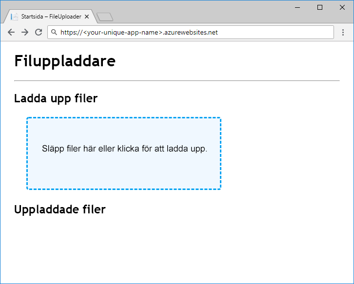

När vi har en referens till en blob kan vi överföra och hämta data. `ICloudBlob`-objekt har `Upload`- och `Download`-metoder som stöder bytematriser, strömmar och filer som källor och mål. Vissa typer har ytterligare metoder för att underlätta &mdash; exempelvis har `CloudBlockBlob` stöd för att överföra och hämta strängar med `UploadTextAsync` och `DownloadTextAsync`.

## <a name="creating-new-blobs"></a>Skapa nya blobbar

Om du vill skapa en ny blob anropar du en av `Upload`-metoderna för en referens till en blob som inte finns i lagring. Två saker händer: Blobben skapas i lagring och data laddas upp.

## <a name="moving-data-to-and-from-blobs"></a>Flytta data till och från blobbar

Att flytta data till och från en blob är en nätverksåtgärd som tar tid. I Azure Storage SDK för .NET Core kommer alla metoder som kräver nätverksaktivitet att returnera `Task`, så se till att du använder `await` i dina kontrollantmetoder på rätt sätt.

En vanlig rekommendation när du arbetar med stora dataobjekt är att använda strömmar i stället för minnesinterna strukturer som t.ex. bytematriser eller strängar. Detta förhindrar att hela innehållet buffras i minnet innan det skickas till målet. ASP.NET Core har stöd för läsning och skrivning av strömmar från begäranden och svar.

## <a name="concurrent-access"></a>Samtidig åtkomst

Andra processer kan lägga till, ändra eller ta bort blobbar samtidigt som din app använder dem. Använd alltid kod på ett defensivt sätt och förutsäg problem som kan orsakas av samtidighet, t.ex att blobbar tas bort samtidigt som du försöker ladda ned från dem eller blobbar vars innehåll ändras när du inte förväntar dig det. Se avsnittet Ytterligare läsning i slutet av den här modulen för information om hur du använder AccessConditions och blobblån för att hantera samtidig blobbåtkomst.

## <a name="exercise"></a>Övning

Nu ska vi slutföra vår app genom att lägga till uppladdnings- och nedladdningskod, och sedan distribuera den till Azure App Service för att testa den.

### <a name="upload"></a>Ladda upp

Vi laddar upp en blob genom att implementera metoden `BlobStorage.Save` med hjälp av `GetBlockBlobReference` för att få en `CloudBlockBlob` från behållaren. `FilesController.Upload` skickar filströmmen till `Save`, så att vi kan använda `UploadFromStreamAsync` till att genomföra uppladdningen för maximal effektivitet.

I redigeraren, ersätter `Save` i `BlobStorage.cs` med följande kod:

```csharp
public Task Save(Stream fileStream, string name)
{
    CloudStorageAccount storageAccount = CloudStorageAccount.Parse(storageConfig.ConnectionString);
    CloudBlobClient blobClient = storageAccount.CreateCloudBlobClient();
    CloudBlobContainer container = blobClient.GetContainerReference(storageConfig.FileContainerName);
    CloudBlockBlob blockBlob = container.GetBlockBlobReference(name);
    return blockBlob.UploadFromStreamAsync(fileStream);
}
```

> [!NOTE]
> Den strömbaserade uppladdningskod som visas här är effektivare än att läsa filen till en bytematris innan den skickas till Azures blobblagring. Men den ASP.NET Core `IFormFile`-teknik som vi använder för att hämta filen från klienten är inte en verklig strömmande implementering från slutpunkt till slutpunkt och passar bara till att hantera uppladdningar av små filer. Se avsnittet Ytterligare läsning i slutet av den här modulen för mer information om helt strömmade filuppladdningar.

### <a name="download"></a>Ladda ned

`BlobStorage.Load` returnerar en `Stream`, vilket innebär att vår kod inte behöver flytta byte fysiskt från blobblagringen alls &mdash; vi behöver bara returnera en referens till blobbströmmen. Vi kan göra det med `OpenReadAsync`. ASP.NET Core hanterar läsningen och stänger dataströmmen när den skapar klientsvaret.

Ersätt `Load` med den här koden och spara ditt arbete:

```csharp
public Task<Stream> Load(string name)
{
    CloudStorageAccount storageAccount = CloudStorageAccount.Parse(storageConfig.ConnectionString);
    CloudBlobClient blobClient = storageAccount.CreateCloudBlobClient();
    CloudBlobContainer container = blobClient.GetContainerReference(storageConfig.FileContainerName);
    return container.GetBlobReference(name).OpenReadAsync();
}
```

### <a name="deploy-and-run-in-azure"></a>Distribuera och köra i Azure

Vår app är klar &mdash; nu ska vi distribuera den och se hur den fungerar. Skapa en App Service-app och konfigurera den med programinställningar för vårt lagringskontos anslutningssträng och containernamn. Hämta lagringskontots anslutningssträng med `az storage account show-connection-string` och ange `files` som namn på containern.

Appnamnet måste vara globalt unikt, så du måste välja ett eget namn att fylla i `<your-unique-app-name>`.

```azurecli
az appservice plan create --name blob-exercise-plan --resource-group <rgn>[Sandbox resource group name]</rgn>
az webapp create --name <your-unique-app-name> --plan blob-exercise-plan --resource-group <rgn>[Sandbox resource group name]</rgn>
CONNECTIONSTRING=$(az storage account show-connection-string --name <your-unique-storage-account-name> --output tsv)
az webapp config appsettings set --name <your-unique-app-name> --resource-group <rgn>[Sandbox resource group name]</rgn> --settings AzureStorageConfig:ConnectionString=$CONNECTIONSTRING AzureStorageConfig:FileContainerName=files
```

Nu ska vi distribuera appen. Nedanstående kommandon publicerar webbplatsen till mappen `pub`, zippar upp den till `site.zip` och distribuerar zip-filen till App Service.

> [!NOTE]
> Se till att skalet är fortfarande i den `mslearn-store-data-in-azure/store-app-data-with-azure-blob-storage/src/start` katalogen innan du kör följande kommandon.

```azurecli
dotnet publish -o pub
cd pub
zip -r ../site.zip *
az webapp deployment source config-zip --src ../site.zip --name <your-unique-app-name> --resource-group <rgn>[Sandbox resource group name]</rgn>
```

Öppna `https://<your-unique-app-name>.azurewebsites.net` i en webbläsare om du vill se appen som körs. Det bör se ut som på bilden nedan.



Prova att ladda upp och ladda ned några filer om du vill testa appen. När du har laddat upp några filer kör du följande i gränssnittet för att se vilka blobbar som har laddats upp till containern:

```console
az storage blob list --account-name <your-unique-storage-account-name> --container-name files --query [].{Name:name} --output table
```