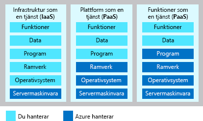

Microsoft Azure är en ständigt växande uppsättning molntjänster som hjälper din organisation att möta nuvarande och framtida affärsutmaningar.Microsoft Azure is a continually expanding set of cloud services that help your organization meet your current and future business challenges. Azure ger dig friheten att skapa, hantera och distribuera program i ett enormt, globalt nätverk med de verktyg och ramverk du föredrar.Azure gives you the freedom to build, manage, and deploy applications on a massive global network using your favorite tools and frameworks. Nu ska vi ta en snabb titt på de överordnade tjänsterna i Azure.Let's take a quick tour of the high-level services Azure offers.

## Azure-tjänsterAzure services

Azure tillhandahåller en mängd olika molnbaserade tjänster, och funktioner läggs till och förbättras varje månad.Azure provides a vast range of cloud-based services, with features added and enhanced every month. 

Vi tar en närmare titt på några av de vanligaste funktionerna:Let's take a closer look at a few of the more commonly-used features: 

- [BeräkningCompute](#compute-services)
- [NätverkNetworking ](#networking-services)
- [LagringStorage](#storage-services)
- [MobilMobile](#mobil-services)
- [DatabaserDatabases](#database-services)
- [WebbWeb](#web-services)

### BeräkningCompute

Compute Services är en av de främsta orsakerna till varför företag flyttar till Azure-plattformen.Compute services are one of the primary reasons why companies move to the Azure platform. Azure har flera olika värdalternativ för program och tjänster, bland annat:Azure provides a range of options for hosting applications and services including:

Här är några exempel på IaaS, PaaS och FaaS i Azure.Here are some examples of IaaS, PaaS, and FaaS in Azure.

|  TypType  |  Tjänstens namnService name             | Tjänstens funktionService function                                                         |
|--------|---------------------------|--------------------------------------------------------------------------|
| IaaSIaaS   | Azure Virtual MachinesAzure Virtual Machines    | Virtuella Windows- eller Linux-datorer i AzureWindows or Linux VMs hosted in Azure                                     | 
| IaaSIaaS   | Azure Kubernetes ServiceAzure Kubernetes Service  | Gör att du kan hantera kluster av virtuella datorer som kör tjänster i containrarEnables management of a cluster of VMs that run containerized services   |
| PaaSPaaS   | Azure Service FabricAzure Service Fabric      | Plattform för distribuerade system.Distributed systems platform. Körs i Azure eller lokaltRuns in Azure or on-premises               |
| PaaSPaaS   | Azure BatchAzure Batch               | Hanterad tjänst för parallella och högpresterande databehandlingsprogramManaged service for parallel and high-performance computing applications |
| PaaSPaaS   | Azure Cloud ServicesAzure Cloud Services      | Hanterad tjänst för att köra molnprogramManaged service for running cloud applications                           |
| FaaSFaaS   | Azure Container InstancesAzure Container Instances | Tillhandahåller containrar utan att kräva VM-etablering eller högre tjänsterProvides containers without requiring VM provision or higher services    |
| FaaSFaaS   | Azure FunctionsAzure Functions           | Hanterad FaaS-tjänstManaged FaaS service                                                     |

### NätverkNetworking

Att länka beräkningsresurser och ge åtkomst till program är huvudfunktionen i Azure-nätverk.Linking compute resources and providing access to applications is the key function of Azure networking. Nätverksfunktioner i Azure omfattar en mängd alternativ för att ansluta omvärlden till tjänster och funktioner i de globala Microsoft Azure-datacentren.Networking functionality in Azure includes a range of options to connect the outside world to services and features in the global Microsoft Azure datacenters.

Azure-nätverksresurser har följande funktioner:Azure networking facilities have the following features:

|  TjänstnamnService name             | TjänstfunktionService function                                                                     |
| -------------             | -------------                                                                        |
| Azure Virtual NetworkAzure Virtual Network     | Ansluter virtuella datorer till inkommande VPN-anslutningar (virtuellt privat nätverk)Connects VMs to incoming Virtual Private Network (VPN) connections                   |
| Azure Load BalancerAzure Load Balancer       | Balanserar inkommande och utgående anslutningar till program och tjänstslutpunkterBalances inbound and outbound connections to applications or service endpoints       |
| Azure Application GatewayAzure Application Gateway | Optimerar appservergruppens leverans samtidigt som programsäkerheten ökarOptimizes app server farm delivery while increasing application security             |
| Azure VPN GatewayAzure VPN Gateway         | Ansluter till virtuella Azure-nätverk via högpresterande VPN-gatewayerAccesses Azure Virtual Networks through high-performance VPN gateways                |
| Azure DNSAzure DNS                 | Tillhandahåller ultrasnabba DNS-svar och ultrahög domäntillgänglighetProvides ultra-fast DNS responses and ultra-high domain availability                 |
| Azure Content Delivery NetworkAzure Content Delivery Network  | Levererar innehåll med hög bandbredd till kunder världen överDelivers high-bandwidth content to customers globally                          |
| Azure DDoS ProtectionAzure DDoS Protection     | Skyddar program i Azure mot distribuerade överbelastningsattacker (DDoS)Protects Azure-hosted applications from distributed denial of service (DDOS) attacks |
| Azure Traffic ManagerAzure Traffic Manager     | Distribuerar nätverkstrafik mellan Azure-regioner över hela världenDistributes network traffic across Azure regions worldwide                           |
| Azure ExpressRouteAzure ExpressRoute        | Ansluter till Azure via dedikerade säkra anslutningar med hög bandbreddConnects to Azure over high-bandwidth dedicated secure connections                   |
| Azure Network WatcherAzure Network Watcher     | Övervakar och diagnostiserar nätverksproblem med hjälp av scenariobaserad analysMonitors and diagnoses network issues using scenario-based analysis                  |
| Azure FirewallAzure Firewall            | Implementerar brandvägg med hög säkerhet, hög tillgänglighet och obegränsad skalbarhetImplements high-security, high-availability firewall with unlimited scalability      |
| Azure Virtual WANAzure Virtual WAN         | Skapar ett enhetligt WAN-nätverk, som kopplar samman lokala och fjärranslutna platserCreates a unified wide area network (WAN), connecting local and remote sites         |

### LagringStorage

Azure tillhandahåller fyra huvudsakliga typer av lagringstjänster.Azure provides four main types of storage services. Dessa tjänster är:These services are:

- **Azure Blob Storage** – tillhandahåller lagring för mycket stora objekt, till exempel videofiler eller bitmappar**Azure Blob storage** - provides storage for very large objects, such as video files or bitmaps
- **Azure File Storage** – skapar filresurser som du kan komma åt och hantera som en filserver**Azure File storage** - creates file shares that you can access and manage like a file server
- **Azure Queue Storage** – implementerar ett lager för köer och tillförlitlig leverans av meddelanden mellan program**Azure Queue storage** - implements a store for queuing and reliably delivering messages between applications
- **Azure Table Storage** – består av ett NoSQL-lager som är värd för ostrukturerade data oberoende av scheman**Azure Table storage** - consists of a NoSQL store that hosts unstructured data independent of any schema

Alla dessa tjänster har gemensamma egenskaper, som är följande:Each of these services shares common characteristics, which are:

- Pålitlig och mycket tillgänglig med redundans och replikering.Durable and highly available with redundancy and replication.
- Säker med hjälp av automatisk kryptering och rollbaserad åtkomstkontroll.Secure through automatic encryption and role-based access control.
- Skalbar med nästan obegränsad lagring.Scalable with virtually unlimited storage.
- Hanterad, tar hand om underhåll och kritiska problem åt dig.Managed, handling maintenance and any critical problems for you.
- Åtkomlig från hela världen via HTTP eller HTTPS varifrån som helst.Accessible from anywhere in the world over HTTP or HTTPS.

### MobiltMobile

Med Azure kan utvecklare skapa engagerande iOS-, Android- och Windows-appar snabbt och enkelt på en mängd olika språk och i valfri utvecklingsmiljö.Azure enables developers to create engaging iOS, Android, and Windows apps quickly and easily in a wide range of languages using their choice of development environment. Funktioner som tidigare tog tid och medförde stora projektrisker, till exempel att lägga till företagsinloggning och sedan ansluta till lokala resurser som SAP, Oracle, SQL Server och SharePoint, är nu enkla att lägga till.Features that used to take time and increase project risks, such as adding corporate sign-in and then connecting to on-premises resources such as SAP, Oracle, SQL Server, and SharePoint, are now simple to include.

Andra funktioner i den här tjänsten:Other features of this service include:

- Synkronisering av offlinedata.Offline data synchronization.
- Anslutning till lokala data.Connectivity to on-premises data.
- Sändning av push-meddelanden.Broadcasting push notifications.
- Automatisk skalning utifrån företagets behov.Autoscaling to match business needs.

### DatabaserDatabases

Azure tillhandahåller flera databastjänster för att lagra en mängd olika datatyper och volymer.Azure provides multiple database services to store a wide variety of data types and volumes. Och med global anslutning blir dessa data tillgängliga för användare direkt.And with global connectivity, this data is available to users instantly.

|  TjänstnamnService name              | TjänstfunktionService function                                                                                |
| -------------              | -------------                                                                                   |
| Azure Cosmos DBAzure Cosmos DB            | Globalt distribuerad databas med stöd för NoSQL-alternativGlobally distributed database that supports NoSQL options                                       |
| Azure SQL DatabaseAzure SQL Database         | Fullständigt hanterad relationsdatabas med automatisk skalning, integrerad intelligens och robust säkerhetFully managed relational database with auto-scale, integral intelligence, and robust security    |
| Azure Database for MySQLAzure Database for MySQL   | Fullständigt hanterad och skalbar MySQL-relationsdatabas med hög tillgänglighet och säkerhetFully managed and scalable MySQL relational database with high availability and security        |
| Azure Database for PostgreSQLAzure Database for PostgreSQL   | Fullständigt hanterad och skalbar PostgreSQL-relationsdatabas med hög tillgänglighet och säkerhetFully managed and scalable PostgreSQL relational database with high availability and security   |
| SQL Server på virtuella datorerSQL Server on VMs          | Var värd för SQL Server-företagsappar i molnetHost enterprise SQL Server apps in the cloud                                                    |
| Azure SQL Data WarehouseAzure SQL Data Warehouse   | Fullständigt hanterat informationslager med integrerad säkerhet på alla skalningsnivåer utan extra kostnaderFully managed data warehouse with integral security at every level of scale at no extra cost    |
| Azure Database Migration ServiceAzure Database Migration Service    | Migrerar databaser till molnet utan ändringar i programkodenMigrates your databases to the cloud with no application code changes                  |
| Azure Redis CacheAzure Redis Cache          | Cachelagrar data som används ofta och statiska data för att minska svarstiden för data och programCaches frequently used and static data to reduce data and application latency                   |
| Azure Database for MariaDBAzure Database for MariaDB | Fullständigt hanterad och skalbar MySQL-relationsdatabas med hög tillgänglighet och säkerhetFully managed and scalable MySQL relational database with high availability and security        |

### WebbWeb

Här är några av webbtjänsterna i Azure:Web services in Azure include the following facilities:

| Tjänstens namnService Name | BeskrivningDescription |
|--------------|-------------|
| Azure App ServiceAzure App Service | Skapa snabbt kraftfulla molnappar för webben och mobila enheter.Quickly create powerful cloud apps for web and mobile. |
| Azure Notification HubsAzure Notification Hubs |Skicka push-meddelanden till valfri plattform från valfri serverdel.Send push notifications to any platform from any back end. |
| Azure API ManagementAzure API Management | Publicera API:er till utvecklare, partner och anställda på ett säkert sätt och efter behov.Publish APIs to developers, partners, and employees securely and at scale. |
| Azure SearchAzure Search | Fullständigt hanterad sökning som en tjänst.Fully managed search as a service. |
| Funktionen Web Apps i Azure App ServiceWeb Apps feature of Azure App Service | Skapa och distribuera affärskritiska webbappar i stor skala.Create and deploy mission-critical web apps at scale. |
| Azure SignalR ServiceAzure SignalR Service | Lägg enkelt till realtidsfunktioner för webben.Add real-time web functionalities easily. |

Nu när vi har identifierat några av de områden som kan göra det intressant för ett företag att migrera till Azure ska vi titta på vad som krävs för att använda tjänsterna och funktionerna.Now that we've identified some of the areas that might interest a company looking to migrate to Azure let's look at what it takes to use the services and features.
