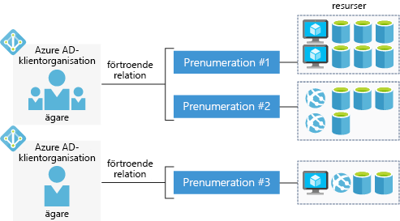

Med ett kostnadsfritt Azure-konto kan du skapa, testa, och distribuera företagsprogram, skapa anpassade webb- och mobilmiljöer och få insikter från data med machine learning och kraftfull analys.

## Vad är ett Azure-konto?

En _Azure-konto_ är knuten till en viss identitet och innehåller information som:

- Namn, e-post och Kontaktinställningar
- Faktureringsinformation, till exempel ett kreditkort

Ett Azure-konto är kopplat till en mer _prenumerationer_.

## Vad är en Azure-prenumeration?

En _Azure-prenumeration_ är en logisk behållare som används för att etablera resurser i Microsoft Azure. Den innehåller information om alla resurser som virtuella datorer, databaser osv. Det har också en förtroenderelation till en enda Azure AD _klient_ som används för att autentisera användare och roller för de resurser som lagras i prenumerationen.

Fakturering sker på prenumerationsnivån. Du kan konfigurera utgiftsgränser på varje prenumeration för att säkerställa att du inte förvånad i slutet av månaden. 

## Vad är en Azure AD-klientorganisation eller Azure AD-klient?

Azure AD (Azure Active Directory) är en modern identitetsprovider som har stöd för flera protokoll för autentisering för att skydda program och tjänster i molnet. Den har _inte_ detsamma som Windows Active Directory, som fokuserar på att skydda Windows-baserade datorer och servrar. Azure AD är i stället om webbaserad autentisering standarder som OpenID och OAuth.

En enda klient representerar en logisk struktur och gör att flera identiteter kan komma åt och använda resurser som skyddas av den klienten. En Azure-prenumeration alltid har en förtroenderelation med en _enda_ Azure AD-klient, men _flera_ prenumerationer kan dela en enda klient. Den här strukturen kan organisationen för att hantera flera prenumerationer och ange säkerhetsregler över alla resurser som de innehåller.

Här är en enkel representation av konton, prenumerationer, klienter och resurser.

Observera att varje Azure AD-klienten har en _Kontoägare_. Det här är den ursprungliga Azure-konto som ansvarar för fakturering. Du kan lägga till ytterligare användare i klienten och även bjuda in gäster från andra Azure AD-klienter åtkomst till resurser i prenumerationerna.

## Typer av Azure-konton

Azure har flera typer av konton som tillgodoser olika kundtyper. De vanligaste kontona är:

- Kostnadsfritt
- Betala per användning
- Enterprise-avtal

### Kostnadsfritt Azure-konto

Ett kostnadsfritt Azure-konto innehåller en **kredit på 200 USD** som du kan spendera under de första 30 dagarna, kostnadsfri tillgång till de populäraste Azure-produkterna i 12 månader och tillgång till fler än 25 produkter som alltid är kostnadsfria. Det här är ett utmärkt sätt för nya användare att komma igång. Om du vill skaffa ett kostnadsfritt konto behöver du ett telefonnummer, ett kreditkort och ett Microsoft-konto.

> [!NOTE]
> Kreditkortsinformation används för endast din identitet. Du debiteras inte för tjänsterna du förrän du har uppgraderat.

### Azure-konto där du betalar per användning

Med ett konto där du betalar per användning (PAYG) debiteras du varje månad för de tjänster som du använder. Den här typen av konto är lämplig för ett stort antal användare, från enskilda användare till små företag och stora organisationer.

### Azure Enterprise-avtal

Ett Enterprise-avtal erbjuder flexibilitet för att köpa molntjänster och programvarulicenser genom ett avtal, med rabatter för nya licenser och Software Assurance. Det är framförallt avsett för stora organisationer.

## Sammanfattning

Oavsett om du är en individ, ett litet företag eller ett större företag behöver du ett konto för att kunna använda Azure-tjänster. Vanliga sekvensen är att börja med ett kostnadsfritt konto så att du kan utvärdera Azure-tjänster. När utvärderingsperioden upphör att gälla konverterar du från det kostnadsfria kontot till att betala per användning.